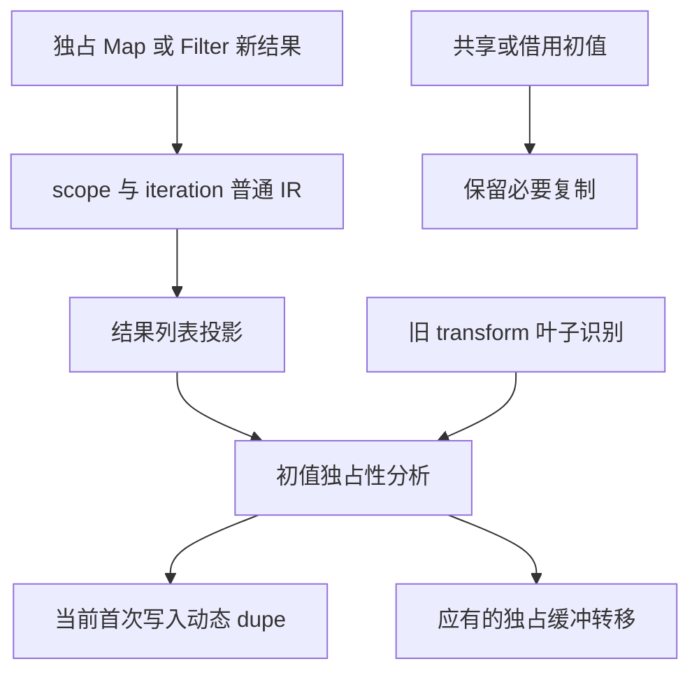
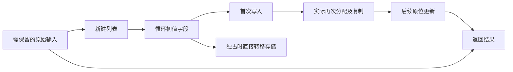

# 集合新结果所有权转移回归

## Intent：最终目标

区分旧生成文本统计范围错误与真实多余复制，确认独占的新建 Map/Filter 结果作为普通循环初值时，是否保留已承诺的所有权转移。保留共享/借用初值的必要复制，不通过放宽断言掩盖 zero copy 回归。

## Data：可用证据

原始根固定 bbd92b5c5，test-loop-initial-ownership 的 map/filter/local/nested/tuple 五个生成步骤报 UnexpectedOwnedInitialCopy，尚未运行后续行为与 OOM 测试。旧 shape 从 execute 统计到全文结束，因此最初考虑后续 executeValue 污染计数；不能据此直接认定无害。

独立诊断使用同一固定根实际生成的 CLI 复制件，复制八个原始 fixture，在新的外部运行目录逐项生成普通 Zig。八次 CLI 真实退出 0，保存源码、参数、哈希与完整生成产物。普通 execute 单独截取到顶层结束行后，五个新建结果模式仍各有一条动态列表 dupe，且没有所有权转移所需的 constCast；每项还存在一条空列表 dupe。后者长度为零，不把它当作实际元素复制证据。

动态复制位于首次写入的状态缓冲初始化分支，例如 map 的 state_items_10 = try allocator.dupe(u64, operand_15)。源来自刚生成的 Map 结果，非空输入且至少一次写入时会分配并复制该结果；这五个 fixture 没有在循环外保留该新结果的别名。它们只有原始输入需保留，不应因此复制已经独占的新列表。

shared、borrowed、repeated 三个对照确实需要复制以保护外部输入或旧别名，继续保留原有要求。实际八份生成产物中，borrowed 普通入口有一条动态复制，其余有动态复制及空初始化，两种成本不得混为一谈。

后端 iteration_buffer/ownership/root.zig 对集合新分配叶子的识别仍停留在旧 transform 的 map/filter；它已有 reference/object/tuple/scope 与 allocating call 追踪，仍不能解析当前 scope 内 iteration 的 result 投影。转移未获证明时，list_update.zig 选择 dupe，与实际产物一致。相关 ownership 分析、集合 lowering 和八个 fixture 在 bbd92b5c5 到 695c654ce 静态未变。真实执行仅属于 bbd，静态比较不是新版本执行。

## Edges：边界与限制

不修改生产实现，不把所有 iteration 一概判为 fresh，不恢复旧 transform，不删除共享/借用复制保护。修复应追踪当前普通 IR 的结果投影、独占区域及初值来源，并保持引用共享和旧结果寿命。

本诊断是八次源生成与实际代码证据，没有执行新的运行时测试，不宣称数值、OOM 或完整专项已通过。原始 shape 的空列表 dupe 文本也可能过于粗糙；未来测试维护应区分零长度初始化与实际列表复制，仍需保留有效的非空复制和转移证据。

实际目录为 `/Users/xiewendao/.codex/conformance/ordinary-entry-resource-bbd92b5c5/r2`。首轮诊断错误地预期收窄后全部无复制，第一项 map 就反证该预期；保留 r1 产物，不修改冻结根。第二轮只收集真实数据，不用预期结论限制输出。

## Answer：交付与成功标准

向已授权实现会话报告已确认的独占新结果复制回归。修复后在新固定源码运行完整既有初值所有权 source/library 两路线、两模式及分配失败测试，再根据真实生成与运行成本调整过粗的零长度文本统计。当前生成证据不等于修复验收。

## 架构图

## 数据流图

## 自我批判

新增公开入口确实可能污染全文计数，但不能把相邻问题的解释直接套到这一项。实际单入口产物反证了最初假设，必须承认真实动态复制仍在。空列表初始化和非空结果复制分别记录，不用方法名出现次数替代复制成本，也不把共享对照的必要复制列为缺陷。
