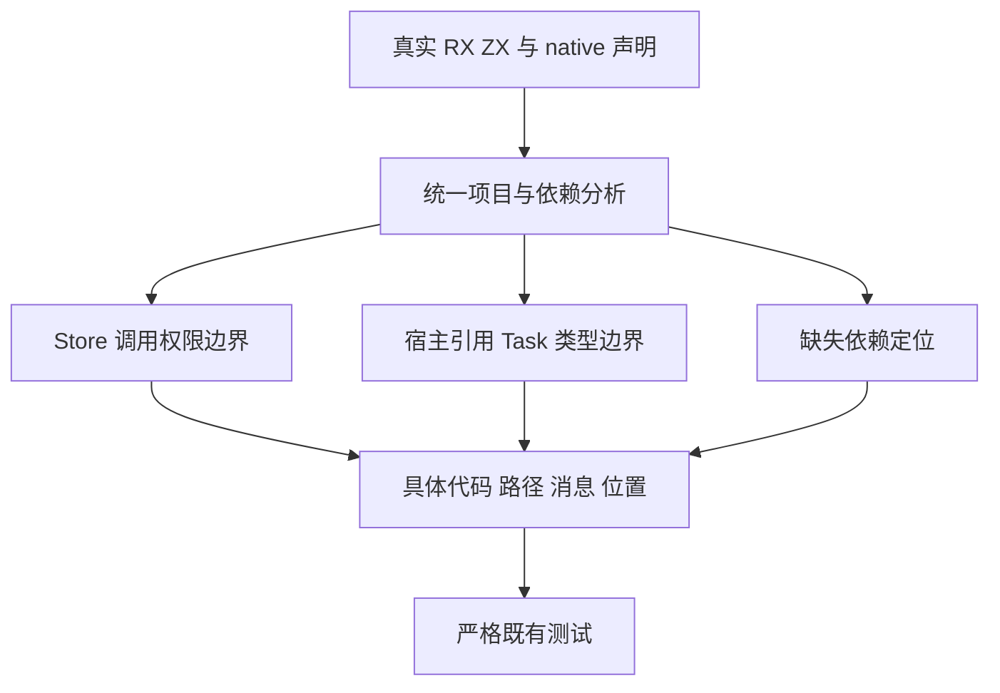

# 项目诊断与异步边界定位门禁

## Intent：最终目标

维护迁移后的严格诊断测试，保留缺失依赖、Store 权限和宿主引用异步边界的拒绝能力，恢复失败后重建与 watch 恢复路径的真实执行。

## Data：可用证据

固定 bbd92b5c5 的原根 Debug 已实际暴露三组旧诊断期望：

1. RX 项目和 watch 共三处仍要求旧 import target 文案，当前统一源码依赖图输出 functions/plus.zx:1:1 的 module 诊断，消息为 source module dependency is missing from the registered input set。原程序保留、删除后恢复等后续断言此前没有执行，不能先计为通过。
2. Store function 组 helper_write 在普通 import 边界就被拒绝，当前 write.zx 的 module 诊断说明依赖未在所需授权上下文分析；missing_parameter 在 main.rx 的 Call.fn 属性处被 prepare 拒绝，仍是 capability。分配失败用例重复触发旧 helper_write 断言，不是已确认 OOM 实现问题。
3. native optional reference Task 组的拒绝代码 capability、消息 tasks cannot return host references、source_index=0 均已通过，唯一不符为 span_text：Indexed 指向完整 async empty()，旧 Native 使用空范围。完整 Task 范围更准确，不能把期望改为 null 跳过检查。

## Edges：边界与限制

预期修改范围为 RX CLI 三份既有 TS、Store function 单份 Zig 与 native reference rejection 单份 Zig，最多五个文件；真实差异逐项确认，不做全局文案替换。普通 ZX 项目仍可能使用旧 import target 文案，不越界修改。

RX 缺失依赖正则保留 importing file、1:1、module、完整消息及行尾约束，兼容路径分隔符与 CRLF。Store 保留具体代码、文件、原因与 Call 位置；宿主引用保留完整消息、源码索引和严格非空 span。合法程序与其他负面情形保持现有断言。

执行完整既有 RX inference、RX project CLI、RX watch、native reference analysis 专项。watch 必须真正越过删除依赖后的旧产物保持、恢复依赖、重新构建及新输出检查，不能仅观察报错。命名用例、分配失败扫描和模式重复分别计数。

正式修改已冻结于新的固定工作树；Debug 与 ReleaseSafe 联合门禁现已真实完成，详见《执行记录.md》。不把诊断维护报告为实现缺陷，也不修改其他仍运行的专项输入。

2026-10-10 进展：已按五文件范围完成草稿。固定 bbd CLI 独立复现 helper_write 为 write.zx:1:1/module、missing_parameter 为 main.rx:1:50/capability，并保存完整消息与源码身份。只读审查确认普通 import 不继承 Store 权限，前者在 import 边界拒绝符合原非法用例；后者在 Call.fn 签名前移校验，不是允许非法调用。新增完整消息和位置断言，只针对这两个模式。

三份 RX CLI 草稿在独立目录使用同一固定 bbd CLI 真实预执行：项目九条、watch 一条全部退出 0，输入哈希未变，恢复分支实际越过删除依赖、旧程序保持、恢复和重建。不是当前版本两模式结果。三份旧 TS 会由仓库现行 Prettier 和提交钩子统一缩进；语义修改仍仅三处严格正则。

正式门禁与产品缓冲转移范围维护、现有 SIMD 修复复测共用一个固定构建，执行六个目标，分别保存两模式终态。五份诊断维护文件及一份产品维护文件已经进入 `72a958bb67592cfb4ac192f00bd48ba354cbc396`；本轮分别提交验证记录，不重复提交已有代码，不修改冻结输入。

## Answer：交付与成功标准

完整两模式实际执行、身份与终态证据证明原有拒绝和恢复路径成立；确认真实实现缺陷才报告授权实现会话。记录采用 IDEA、附架构与数据流图、自我批判，完整部分用英文 Conventional Commits 提交并推送。

## 架构图

## 数据流图

## 自我批判

测试失败不自动代表实现错误，但新诊断也不能随意接受。每处必须证明拒绝的是原先那项约束，保留精确归因，而不是匹配任意 module/capability。迁移使定位更准确时更新具体期望；未执行到的恢复分支须靠真实执行补足，不能根据相邻分支通过来推测。

固定旧 bbd CLI 的项目九条、watch 一条和 Store 两次预期拒绝曾作独立预执行，不能把它当作正式两模式结果。本轮交付以外部保留的正式输入、真实终态及具名重放为依据。运行、收集与预验证归档脚本已移到仓库外，docs 只保留 Markdown 计划与记录。
