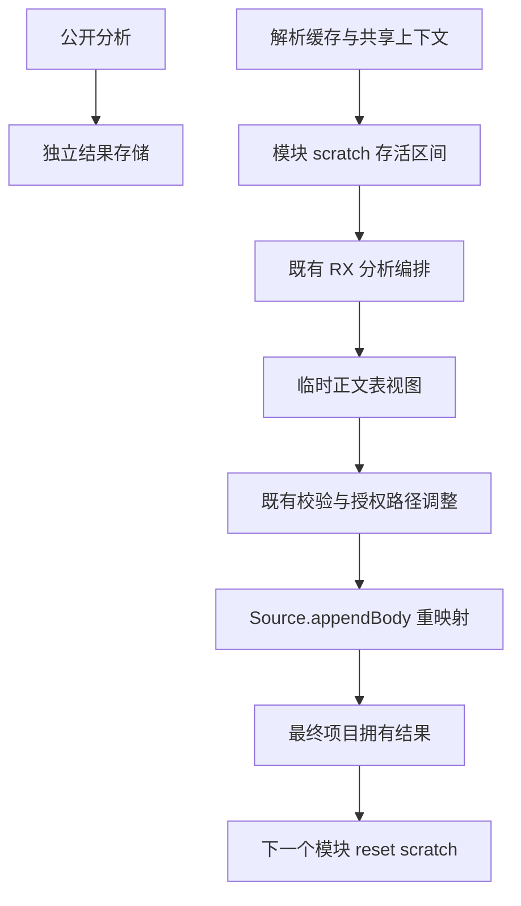
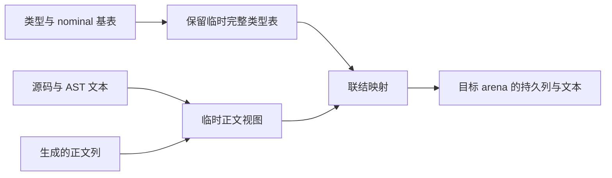

# 内部分析与联结生命周期

## Intent：最终目标

在 RX mixed 项目的单模块编译中，消除“分析结果先深复制到临时存储，随后联结再复制到最终项目”的第一轮正文表复制。公开 analyze / analyzeWithContext 的独立拥有权不变，不保留跨模块中间 arena，不新增运行库。

## Data：可用证据

- mixed/zx.zig 是 analyzeResolvedIn 的唯一调用点；该接口只由内部 frontend 导出，没有在 compiler 公共 root 导出。
- mixed 在每个模块开始时 reset State.scratch，分析、Store 授权路径调整、Source.appendBody 均在下一次 reset 之前完成。
- 现有 host/root 创建子 arena，生成完成后 publish 深复制正文五表及字符串，然后立即销毁子 arena。
- Source.appendBody 再校验并通过 Nodes.function 重映射复制到 destination.allocator；这份最终结果跨模块存活。
- borrow.columns 只转换描述符，contracts.copy 的 replacements 不重复复制已替换字段；不能把它们误认为可以直接删去的重复复制。

## Edges：边界与限制

- 只改变受控的内部 resolved 接口：要求显式传入调用者 arena，返回视图的有效期受该 arena、解析缓存及 context 输入共同约束。调用点必须在 reset 前完成联结，临时 IR 不进入 finished 或普通 AnalysisResult。
- 公开拥有结果继续深复制输入借用，支持调用方提前释放 Parsed。
- generated 路径使用编译期选择的 owned/borrowed 发布，不增加运行时分发；seed 继续已有拥有式分析。
- 类型和 nominal 基表及 delta 的临时拥有转换先保留；联结可能扩展 destination 并重分配其列，不能借用可被联结改写的基表。
- Store 初始化器、verified function prefix、函数表与 native module 视图校验顺序不变；不得为提速跳过任何门禁。
- 不引入静态回调框架或泛化 consumer；现有唯一调用点已提供可明确审计的顺序生命周期。

## Answer：交付与成功标准

核对唯一调用关系、发布列 ABI 和生命周期，执行既有 mixed/RX/资源相关专项，不新增测试。用固定语料比较真实生成产物和成本；若性能或资源检查退化，修正或撤回优化，不能只凭删除 dupe 宣称提速。

## 自我批判

本块是跨阶段生命周期与复制优化，不等于主分析器状态或项目编排已全部迁入 RX/ZX。类型基表复制、最终重映射复制和宿主 ABI 适配仍存在。Zig 不提供自动借用检查，因此显式 arena 参数、内部接口范围与单一顺序调用点是必须保留的审计边界。

## 静态复核

只读复核未发现本次新增悬挂指针或栈描述符逃逸：control 描述符与 exports 数组仍在 arena；publish 没有将 prepared/context/input 的顶层局部描述符放进 Program；最终 Nodes.function 对嵌套 contract 表也执行拥有转换。setter 仍先复制路径描述符数组再替换路径，没有写入借用列。门禁顺序保持不变。

generated 中间分配现在存活到 appendBody 完成，较原分析返回时销毁子 arena 更晚。虽然下个模块仍 reset、没有跨模块累计，单模块联结峰值仍可能变化，必须实测；不能仅因省去复制就断言内存不变。内部接口补充借用生命周期说明，后续新增调用者必须同时维持 parsed、context 和 arena 的有效期。

## 验证结果与撤回决定

构建通过 12/12 步骤，既有 RX 推导、契约、模块记录专项通过 36/36 步骤、154/154 用例；未新增测试。固定 1,291 个源文件、42 个入口的 1,212 个 Zig 产物哈希全部一致。

| 条件             |     原实现 |   借用优化 |   差值 |
| ---------------- | ---------: | ---------: | -----: |
| 生成冷缓存       | 114.543 秒 | 114.429 秒 | -0.10% |
| 生成热缓存第一轮 |  75.087 秒 |  76.531 秒 | +1.92% |
| 生成热缓存第二轮 |  74.997 秒 |  76.686 秒 | +2.25% |

热缓存均确认 0 generated、1169 reused。冷缓存峰值 RSS 从 16,611,733,504 字节降至 16,047,521,792 字节。第一轮热缓存峰值从 16,592,965,632 降至 16,047,480,832 字节。初次 baseline 实际未命中缓存，已按真实输出改记 cold，没有混入 warm 对比。

用户将构建耗时作为第一指标。两轮热缓存退化方向一致，当前收益不足以接受该实现。因此已精确撤回上述 5 个文件中的本块改动，保留原独立拥有发布；未提交借用优化代码，也未改动其他会话文件。被撤回 diff 保存于本地忽略的日志，供后续定位分配器生命周期成本。

这些数字是生成阶段对照，不等于完整编译器构建。Native AST 接入的完整构建约 2% 观测退化另见《构建成本对照》，仍保留为未解决项。表达式迁移后另行测量，不混用语料或二进制。
