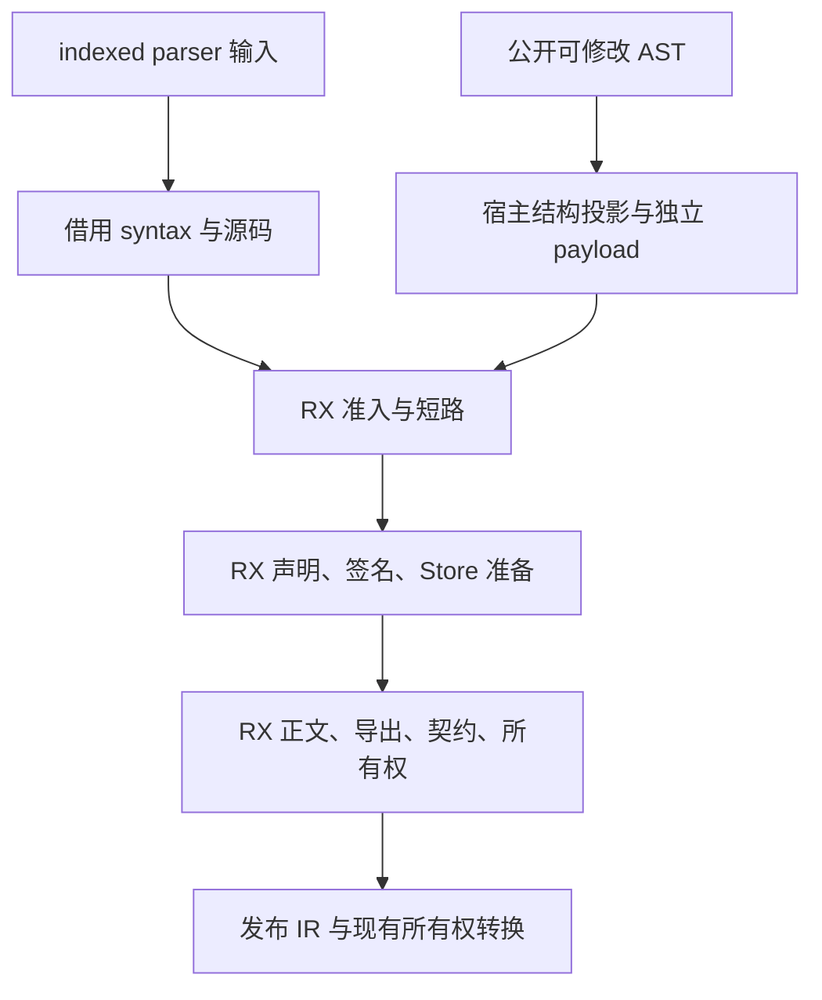
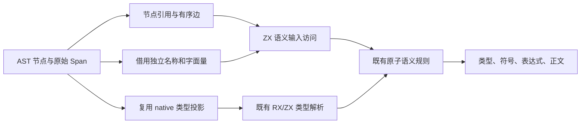
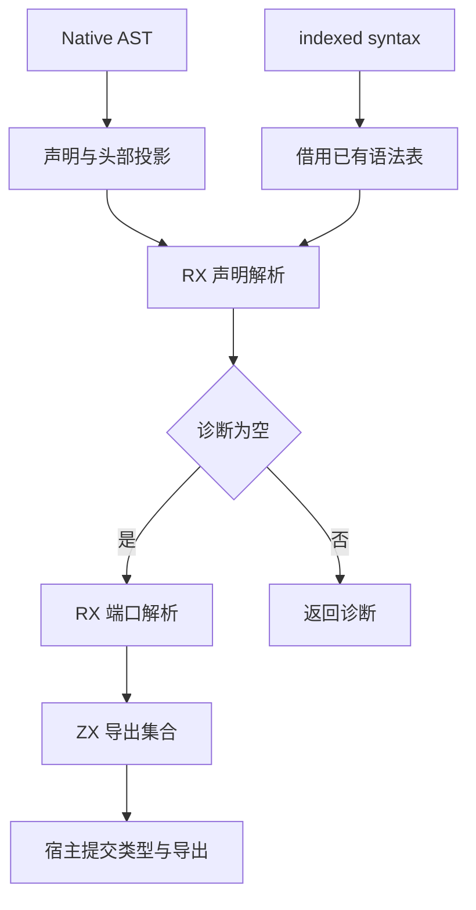

# 原生 AST 分析迁移

## Intent：最终目标

让公开 `Parsed.ast` 与 indexed parser 输入进入同一 RX/ZX 分析流程，消除 generated 配置下 `Native.analyze` 对旧 Analyzer 的调用。保留调用方修改 AST 的语义和原诊断位置，不重新解析源码。

## Data：可用证据

- `core/ast.zig` 的名称、数字、字符串和模板文本独立于 Span 保存。
- 现有 `frontend/program_adapter` 只支持 indexed → native，不能反向复用其输出文本读取规则。
- `analyzer/expressions/leaf.zx`、模板遍历、名称读取及 resolved admission 仍根据源码位置取值。
- `semantic/resolving/host/native.zig` 已有带引用去重和待处理队列的 native 类型投影，支持独立 enumeration，必须复用。
- 表达式、语句的 parser 索引模型已覆盖现有 AST variant，主要差异是文本来源、类型引用和诊断位置。

## Edges：边界与限制

- indexed 输入继续借用原 syntax 表和 source，不为兼容 native 而复制整张语法树或所有文本。
- native 路径需要将 Zig 指针 AST 投影为显式节点引用；这个兼容适配仍是过渡宿主边界，不宣称完整状态自举。
- 不按 Span 建立文本覆盖表：不同节点可以共用相同 Span，不能由位置猜测节点身份。
- seed 保留旧实现；generated 配置切换前必须补齐全部表达式、语句、contracts、Store 标志、空 return、annotation、type argument、depth 和 function_start。
- 不新增测试、不运行全量测试，不触发 CI。复用既有 native 分析、模块与资源专项；固定语料比较实际生成耗时，不凭移除旧调用宣称提速。
- 本块不处理解析器公开 AST 类型的删除，不改变外部 API，不将注释或 token 重新解释为语义输入。

## Answer：交付格式与成功标准

### 输入边界

ModuleInput 增加可选 native 语义输入。indexed 入口传空值；native 入口提供复用的 native 类型表、显式类型引用和按节点身份排列的文本列。

表达式 Source 保留现有 tree、blocks、bytes，并携带同一个可选 native 语义输入；原子访问器按职责读取其 text、types 或 import_names。名称访问按 expression、field、parameter、statement、destructure 的节点索引选取；数字、字符串和模板使用各自的 payload 列。Span 始终用于诊断，与文本长度无关。

导入名称使用独立列参与 admission；声明与导出名称复用已有 resolving Source 的 native 声明视图。类型 annotation 通过明确的 Reference 读取，不能用伪造源码偏移或整数位编码区分 enum。

### RX 阶段图

### 数据流

### 验收

1. 每一种 AST variant 与原始顺序都有可核对的结构映射；名称和字面量不再依赖原源码内容。
2. indexed 路径不增加文本复制；native 转换成本与剩余宿主依赖如实记录。
3. generated 的 Native.analyze 不调用旧 Analyzer，seed 行为保留。
4. 既有专项通过，固定语料产物与耗时核验通过；之后才将这一调用路径移出剩余清单。

## 自我批判

可选 native 输入会扩大分析器输入类型图，并增加访问分支；必须测量实际影响。新增一层结构投影也不能被称为零复制。仅改 leaf 会遗漏字段、lambda 参数、模板、Store、导入及类型 annotation，因此按完整输入职责实施，而不是逐个用例打补丁。

## 实施与验证进度

- 已实施名称、literal、模板、类型引用和导入名称访问器，以及 native AST 的迭代式结构投影。表达式指针去重，按队列填充节点；各有序集合使用现有 previous 链约定。
- `Native.analyze` 已按 generated 配置接入同一分析流程，seed 保留旧实现；固定 stage0 构建已通过 12/12 步骤，所选既有专项及固定语料性能对照已通过。
- `grit` 对此次 `.zx` 输入报告处理 0 个文件，未执行批量改写；随后按已逐项核对的节点索引进行受控替换，并使用实际 `zxc fmt` 检查。
- 首轮 nullable 子字段在 RX 属性内投影引起 object/optional 约束冲突；隔离诊断定位到 native 字段。改为跨阶段传递同一个完整 NativeModule 视图，具体数据列由 ZX 原子访问器读取。没有新增语义总控或转发模块。RX 对此类 nullable 子字段投影的推导缺口尚未修复，不宣称该能力已补齐。
- 三个既有入口 analyzer、source_signature、expression_analysis 的生成检查通过：549 个函数文件。这不是 native 行为验证。
- 静态复核发现 native String 的 AST payload 包含引号；已改为按 payload 自身裁切，再解码。模板文本保持原契约。
- native 类型与声明来自独立类型视图，投影中的 indexed 类型/声明表为空；tokens/comments 不参与分析。import path 仍由 Native.header 的原 AST 提供，投影中的 path span 不供 resolver 使用，不能把此投影当作完整 parser 输出。
- 名称和字面量借用 AST 字节，结构与描述符在本次分析临时 arena 中构造；publish 仍执行既有拥有权复制。签名后续接线见下文；宿主类型提交和其他过渡边界继续保留。

- 宿主借用校验发现 ArrayList 的可写外层 slice 与只读输入列不匹配；在调用点显式转为只读 slice，保留递归布局校验，没有放宽 canonical borrow 约束。
- 构建证据：`原生AST分析构建.log`。固定 stage0 为 `/tmp/zxc-project-binding-value/bin/zxc-bootstrap`，优化配置 ReleaseSafe，bootstrap 宿主保持既有 ReleaseSmall。此构建不代替三阶段自编译。

### nullable 投影缺口的追加核对

只读源码核对确认该缺口贯穿推导与降低：RX 条件表达式没有为两个分支分别建立条件事实，现有 assumeNonNull 只接受整个 binding；正式 ZX refinement 的非空事实按 symbol ID 保存，字段投影没有对应的非空证明。因此，不能只放宽 optional/object unify，也不能只修 RX 推导便宣称完成。后续需要统一的字段路径事实、分支作用域和投影证明，并保持未受保护的 optional 字段访问被拒绝。本次接入不修改这套语言规则。

### 固定语料性能与产物

固定此前的 1,291 个源码、42 个入口，不将本次新增源文件混入对照语料。旧编译器为绑定值 ABI 版本，新编译器为本次 native 分析版本；两者使用相同工具链和配置。

| 条件           |                         旧版 |                新版 |
| -------------- | ---------------------------: | ------------------: |
| 冷生成         | 114.438 秒（前轮同语料记录） |          114.130 秒 |
| 热缓存生成     |            76.368 秒（本轮） |           76.089 秒 |
| 热缓存最大 RSS |          16,624,922,624 字节 | 16,611,774,464 字节 |

1,212 个 Zig 产物文件路径与 SHA-256 完全一致。热缓存仍有约 29.4 秒推导、46.0 秒 emission，当前缓存没有消除这两项成本。结果只支持该固定生成路径未见明显退化；并发专项仍在运行，微小差异不作为提速结论。整套 Zig 冷构建、单模块变更，以及 native AST 投影自身成本仍需分别核实。

证据保存在被 gitignore 排除的 `原生分析性能-*.json/.log` 与 `原生分析性能产物比较.json`。

### 本块验收

`zig build test-contracts test-type-resolution test-expression-bindings -Doptimize=ReleaseSafe -j2 --summary all` 通过 43/43 个步骤、119/119 个测试。包含既有 native `compiler.parse` → `compiler.analyze` 契约路径与分配失败清理检查，没有新增测试或执行全量测试。证据为 `原生AST分析专项.log`。

`zig fmt --check` 与本块 `git diff --check` 通过；只读结构复核覆盖全部 AST 表达式、语句 variant、有序链和引用哨兵，未以增加特例处理用例。现有专项并不等价于对任意调用方手工修改 AST 的穷尽验证，这一限制保留。

完成的是 generated 配置下公开 Native.analyze 接入既有 RX/ZX 分析编排。宿主结构投影、结果拥有权复制及状态承载仍未迁完；Native.signature 接续结果见下文，seed 继续保留旧实现。本块不宣称主分析器完整自举。

## 签名路径接续计划

### Intent

将 generated 配置下 Native.signature 的声明、端口和导出决策接入既有 source_signature RX；保留 seed。签名适配不遍历正文和契约，不引入第二套签名算法。

### Data

当前 Native.signature 仍顺序调用 Types.initialize、Signature.resolve；indexed 签名已有显式 RX 的声明 → 诊断分支 → 端口 → 导出流程，输入现已支持同一个可选 NativeModule。签名只读取声明、是否有正文、正文 Span 与 Store 标志。

### Edges

宿主投影仍为过渡边界。签名只构造头部视图，不能作为正文分析输入使用；选择在编译期确定，不增加运行时分发或复制 AST 文本。导入已由项目阶段处理，签名视图不虚构可用于 resolver 的 import path。保持诊断顺序、类型和名义表提交契约，不改外部 signature 接口。

### Answer

数据流为 AST 声明 → 既有 native 类型视图 → RX 声明状态 → 端口与导出 → 现有类型表。正文只提供存在性和 Span，不进入表达式队列。验收包括构建、既有相关专项和调用闭包核对；没有现有直接覆盖时如实记录，不能将 indexed 项目测试称为 native 签名专项。

### 签名接续结果与自我批判

- generated Native.signature 已进入同一个 source_signature RX；seed 的旧分支保留。头部投影在编译期选择，正文只有原 Span 的空块描述符，不遍历表达式，不复制 AST 文本。
- 固定 stage0 构建通过 12/12 步骤；`test-rx-inference test-parse-cache` 通过 33/33 步骤、152/152 个既有测试，证据为 `原生签名构建.log` 与 `原生签名专项.log`。
- 现有 analyzeSignatures 内部新建 ParseCache，在 generated 配置下正常生成 indexed 输入。没有找到既有测试直接执行 generated Native.signature；上述专项验证共享 RX 签名流程、原生缓存生命周期和 indexed 回归，不能称为该分支的直接动态覆盖。新接线另经编译与逐项静态核对，保留覆盖缺口。
- 本次仅改变宿主适配；RX/ZX 签名算法及生成语料未改动，不重复以同一生成对照证明新能力。整体构建成本另用固定副本测量。
- 宿主签名类型表提交和输出拥有权复制仍是过渡边界。模块外部签名 `modules/signature.zig` 还有单独旧编排，不能因本次完成而从完整自举待办中删除。
