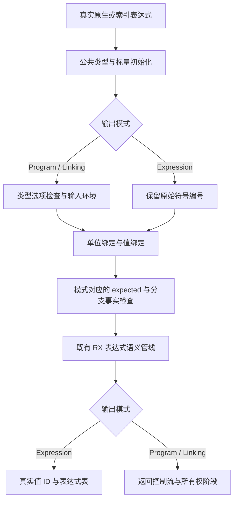
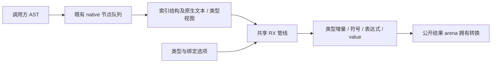

# 原生表达式分析迁移

## Intent：最终目标

公开原生表达式 analyze、compile 和 compileForLinking 复用既有 RX 表达式分析管线，正式入口不再调用旧 Analyzer。保持原始表达式 IR 与完整 Program 各自的既有契约。

## Data：可用证据

- indexed compileInput 已使用 expression_program/compile.rx；原生 analyze 与 compileStage 仍直接创建旧 Analyzer。
- 原始 analyze 只返回类型、符号、表达式和值 ID，没有环境符号、输入 tuple、投影或返回语句；不能从编译后的 Program 猜测或删除节点来模拟。
- 原始路径按单位绑定、逐项绑定类型及名称、expected 顺序检查；Program 路径先检查所有类型和 expected，再创建环境、检查绑定及分支事实。
- Native AST 的节点可能由调用方修改。直接遍历真实 AST 并复用现有 native 队列投影，不能重新解析 source。

## Edges：边界与限制

- 以显式输入模式区分 Expression、Program、Linking；RX 决定环境、事实、收尾与所有权阶段是否执行。ZX 保留绑定集合算法。
- 原始模式维持忽略 nonnull_bindings 与 native_modules 的现有行为；编译模式保持拥有结果及 native module 复制。
- seed 保留旧实现作引导，generated 正式路径切换。宿主 AST 投影仍是过渡依赖，不能将其称为完整自举。
- 不新增测试，不运行全量测试，不调用浏览器；使用既有表达式绑定、运行时、XML 表达式及 RX 推导专项。比较构建耗时，记录性能未满足项。

## Answer：交付与成功标准

成功标准：原生两类公开入口共享 RX 规则，原始符号与值编号契约不变；既有专项通过；构建、调用闭包及性能证据完整记录。新增职责按语义组织，不为行数拆分转发文件。

## 自我批判

直接入口迁移只消除本入口对旧 Analyzer 的运行调用。宿主投影、类型表转换及正式传递闭包仍需逐项验收，不能据此宣布主分析器或完整编译器自举完成。

## 已完成验证

- 固定 stage0 `/tmp/zxc-project-binding-value/bin/zxc-bootstrap` 构建通过 12/12 步骤，输出 `/tmp/zxc-native-expression/bin/zxc-bootstrap`。
- 既有 `test-expression-bindings`、`test-expression-runtime`、`test-xml-expression`、`test-rx-inference` 通过 43/43 步骤、202/202 用例；未新增用例，也未执行全量测试。
- 实际执行 `zxc fmt --write` 格式化本模块 RX/ZX，Zig 格式及本块 diff 检查通过。初版嵌套条件和导入顺序被语法风格门禁拒绝，修正后重新构建；不能把失败轮次记为通过。
- 只读复核确认：raw 的越界、void、名称、expected 优先级保持；符号 ownership 保持 Copy；Program 投影拆分不改变两张独立表的编号；原生类型 pending 在正文投影完成后排空；公开拥有结果在 scratch 释放前完成复制。
- `generated_parser=true` 正式调用链中，模块、raw 表达式、Program/Linking 表达式均进入 generated host；旧 Analyzer 的实例化仅保留在这些入口的 seed 分支。IR seed_scopes 同样由 comptime 条件排除。这是静态调用链核对，不是完整手写依赖消除证明。

完整构建及固定语料对照已完成，结果见下文。

完整构建使用固定副本：从原生 AST/签名接入后的统一基线复制全部 packages，after 只覆盖本块 21 个改动文件，before 2,189 文件、after 2,192 文件。两份项目本地缓存初始为空，保留相同 Zig 全局缓存；共用同一 stage0、ReleaseSafe 和 `-j2`。源码逐文件哈希保存在本地忽略的 `表达式构建成本副本.json`。测试会话的后台编译仍在同机运行，因此单轮微小差值不能视为无噪声测量。

## 固定语料与资源结果

固定 1,291 个源文件、42 个入口的 1,212 个 Zig 产物逐字节一致。热缓存均为 0 generated、1169 reused；生成耗时从 75.690 秒变为 75.389 秒。新二进制冷生成 112.915 秒，峰值 RSS 16,611,360,768 字节；热生成峰值 16,611,328,000 字节，与原实现热生成的 16,611,713,024 字节接近。该语料比较二进制行为，输入保持不变，并非构建改动后源码本身。

自举源码构建对照的冷构建为 188.229 → 186.674 秒，热缓存为 0.176 → 0.186 秒；两侧均 12/12 步骤通过。自举冷构建峰值 RSS 从 14,674,345,984 增至 17,091,915,776 字节，约增加 16.5%。用户以构建耗时为第一指标，本轮时间未观察到退化，但不能据此声称内存改善或稳定提速；同机负载及单轮测量边界继续保留。

单模块变更对照已完成：144.508 → 143.856 秒，变更后缓存命中为 0.176 → 0.179 秒。只改固定副本内 leaf.zx 的一段诊断文本，两侧改动完全一致；没有修改仓库中的业务语义或新增测试用例。全部 8 次构建均通过 12/12 步骤。本块各项耗时未观察到实质退化，保留实现；这不能消除此前原生接入相对更早基线约 2% 的观测，后续仍须优化与复测。

本块 21 个代码文件与已验证副本逐文件哈希一致。提交范围只包含这些文件、本记录和剩余清单；external 加载及其他会话的未提交构建重构不混入。
