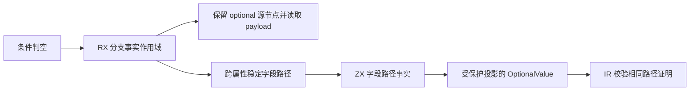
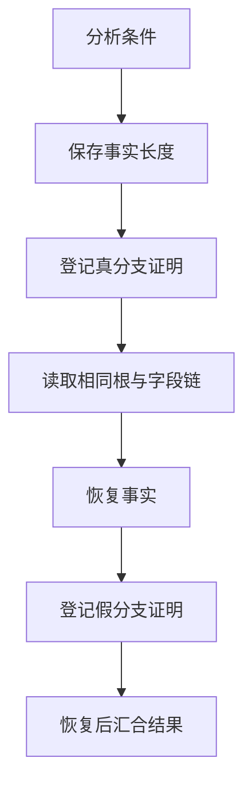

# 可空字段分支事实

## Intent：最终目标

让 RX 判空分支安全读取同一稳定字段路径，并使推导、ZX 分析和 IR 校验使用一致的证明。恢复主分析器先前因能力不足而绕开的 native 类型投影，同时消除实现新增能力时暴露出的状态传递成本。

## Data：可用证据

- 真实历史失败表达式为 `$in.native == null ? null : $in.native.types`。原先为绕过 object/optional 推导冲突，声明阶段接收整个 NativeModule，再由 ZX 提取 types。
- RX 条件和逻辑短路原先未分别建立、恢复字段事实；ZX 与 IR 的非空证明只识别完整 Reference。
- 类型提示也必须遵守相同证明；仅在字段降低中生成 OptionalValue，会被声明类型提示重新包装，进而影响比较和运算。
- 构建成本对照使用当前工作树源集的固定隔离副本、同一 stage0 和工具链。独立 HEAD 副本另行验证仅含本任务变更及最小手工构建接线时的可构建性。
- 固定语料有 1,291 个 RX/ZX 源码和 42 个入口，输入摘要为 `b070bd633b458be912a87cd5042186ea15b394a5521509a728fa4cda3a8f5a73`；运行前重新核对全部文件哈希。

## Edges：边界与限制

- 证明身份为根 symbol 与静态命名字段链，不以某次 AST/IR 节点编号相等作为依据。
- 调用、动态索引和未绑定的动态 Store 读取不作为可复用证明；已经求值并绑定的 getter 结果可按普通稳定 binding 处理。
- RX 只登记当前可见 binding 的完整路径及子路径；根匹配沿 AST 字段目标进行，不使用裸字符串前缀。
- 末端只收窄一层 optional。`??` 左侧保留末端声明的 optional 层，父对象仍按普通读取收窄。
- 不放宽 optional/object 类型统一，不新增专用 runtime，不复制字段数据，不增加隐藏阶段编排。
- 不新增测试或执行全量测试；验证范围为真实编译器投影、既有专项、固定语料与构建成本。
- 仍有 generated 宿主 ABI、legacy seed 和 native hint 的过渡实现；本块语言能力修复不等于主分析器或整个编译器完成自举。

## Answer：交付结果

已实现条件表达式、逻辑短路和 RX Switch 跨属性的字段证明，恢复真实 native 类型投影。证明装载、普通字段读取、只读类型提示及 IR OptionalValue 校验使用一致的稳定路径规则。

### 语义与状态边界

- 字段事实与普通 symbol 事实共享作用域；nonnull 条目与 projected 标志在追加、捕获保留、恢复、宿主 ABI 和缓冲管理中同步。
- 字段路径比较跳过父路径的 OptionalValue，逐层比较字段位置，最终比较根 symbol。类型提示直接读取既有证明，不追加 IR。
- 外部无效路径证明统一返回 `contract: branch fact requires a valid field path`；普通表达式的字段诊断保持不变。
- 字段投影原子函数只接收表达式表、类型表、事实、诊断和投影参数，只返回它实际修改的表达式表、诊断和值编号。
- 引用构造只返回表达式表和值编号；identifier 和 captures 在各自边界合回原状态，保留解析期间新增的绑定及捕获。
- 事实装载循环只更新 expressions、facts、diagnostic，最终一次合回 Analysis。类型表、符号类型和绑定数组按只读列传入。
- 符号查找只接收 active、names、scope_floor 与查询名称，保持逆序查找和遮蔽规则。未添加转发模块或重复实现字段/引用算法。

### 最终验证

| 检查                                     | 实际结果                                                                           |
| ---------------------------------------- | ---------------------------------------------------------------------------------- |
| 恢复真实 native 投影后的 bootstrap-stage | 14/14 步骤通过                                                                     |
| 冻结源码的独立 HEAD 专项                 | 124/124 步骤、204/204 个直接 Zig 测试通过                                          |
| 既有运行用例报告                         | 48/48 通过，覆盖源码与编译库路径                                                   |
| 专项范围                                 | expression-bindings、rx-inference、list-predicates、reduce-initial、context-borrow |
| 固定语料输出                             | 两边均 1,212 个文件，无新增或缺失文件                                              |
| 状态收窄前后输出                         | 1,212 个文件逐字节一致                                                             |

相对旧基线的 5 个产物差异经过逐项审计：4 个是受保护字段解包后按期望类型重新包装，另一个是短路条件内的可空比较收窄。不能将这组结果表述为与旧基线全部字节相同。

独立副本仅叠加本任务源码及 entries、parser、compiler 三处最小生成入口接线，未混入共享构建清单、genz 或其他会话暂存内容。最终功能专项后，5 个 Zig 文件仅按仓库格式器调整空行；逐行排除空行比较确认没有其他字符变化。

### 构建成本

| 场景               |               基线 |   冻结版本 |
| ------------------ | -----------------: | ---------: |
| 冷 bootstrap-stage | 110.324–110.681 秒 | 110.426 秒 |
| 热缓存             |           0.190 秒 |   0.167 秒 |
| 相同单模块修改     |         102.134 秒 | 101.809 秒 |
| 修改后再次命中缓存 |           0.208 秒 |   0.163 秒 |
| 固定语料冷生成     |          37.752 秒 |  37.662 秒 |
| 固定语料热生成     |          32.169 秒 |  32.393 秒 |

基线此前单模块重建为 101.603 秒、热生成为 32.083–32.409 秒；当前结果处于已观测范围。热生成本次单点略高，不将这组小样本表述为稳定提速。初始实现可重复出现的约 1.4%–2% 构建增长已消退。

自举生成源码仍由 1,217 个文件、60,711,633 字节增加到 1,229 个文件、61,021,840 字节；新增能力有源码体积成本，不宣称体积完全不增加。对照没有更改优化等级或减少源码范围。

### 实验与取舍

| 方案                                  | 证据与决定                                                     |
| ------------------------------------- | -------------------------------------------------------------- |
| 初始布尔标志列实现                    | 冷构建 112.321/112.158 秒，单模块重建 103.623 秒；未直接接受   |
| 单 u64 编码事实                       | 112.152 秒，生成源码减少约 141 KB，但无实质耗时收益；不采用    |
| coerce 消除相同 optional 层的重复包装 | 热生成 33.462 秒对基线 32.409 秒；不采用，代码已撤回           |
| 只缩减只读字段路径循环 Context        | 112.203 秒，源码减少约 21 KB；不足以单独消除增长               |
| 收窄字段投影边界                      | 111.431 秒，源码再减少约 349 KB；继续收窄关联边界              |
| 收窄引用及事实装载                    | 111.073 秒；相邻复测 110.808 对基线 110.324 秒，仍保留小幅增长 |
| 收窄符号查找                          | 110.426 秒，进入基线波动范围；冻结并完成最终验证               |

第一轮投影接口调整漏了集合降低的 4 个调用文件，构建在旧契约处失败；全包核对后补齐全部 6 个调用文件。事实 State 首次从逻辑模块导入也被纯类型模块规则拒绝，随后移入同目录 model.zx。两项均已修正并包含在最终验证中。

Grit 的 JavaScript 模式对 ZX 文件处理数量为 0，因此改用限定路径的源码改写；没有将空匹配当作调用点不存在。真实提交钩子会格式化并重新暂存工作树，本块在独立提交内容上执行同等格式检查，避免影响其他会话的暂存与未提交内容。

## 自我批判

正确性修复不能自动当作性能改善，也不能以生成体积缩小代替实际计时。本轮拒绝了没有收益的编码与重复包装实验，最终通过收窄真实读写边界降低成本，但保留了源码体积增加和测量样本有限的事实。

专项通过、真实投影可编译以及固定输出可解释，均不能替代完整职责的传递依赖核验或三阶段自编译。整个分析器的宿主状态、项目流程和 genz 迁移仍在剩余清单中，未将局部能力交付扩大为完整自举结论。
