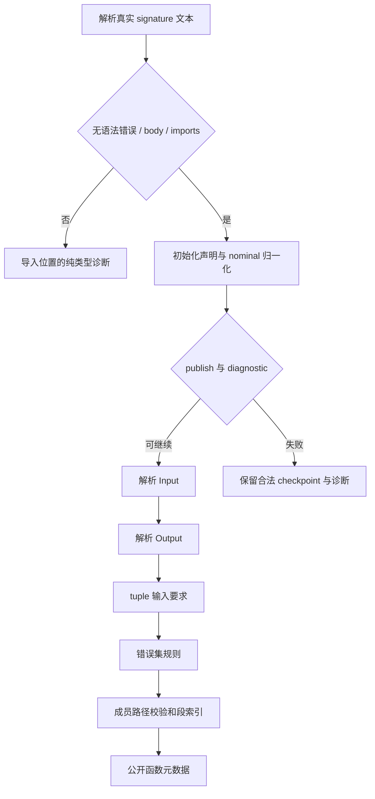
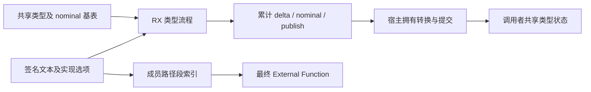

# 外部签名加载迁移

状态：未接纳，已撤回实现。以下设计和检查记录属于一次性能不达标的实验，不代表当前源码已迁移。

## Intent：最终目标

将 legacy external 的签名解析、类型准入、端口解析和实现声明校验迁入真实 RX 编排与 ZX 原子逻辑。保留现有 External 接口和 seed，引导正式入口不再执行 signature.zig 的三次宿主阶段调度。

## Data：可用证据

- project.importExternal → external.load → signature.resolve，目前由 Zig 顺序调用 parser、initialize、named Input、named Output，再校验实现。
- 类型初始化已经使用 semantic/resolve.rx。普通解析错误 publish=true，仍提交部分类型；nominal normalization 冲突 publish=false，不提交该次类型和身份。
- Input/Output 命名查询使用导入 span；signature 的解析失败、有 body 或 imports 统一映射为纯类型模块诊断。
- 初始化解析所有声明，后续端口查询可共享 delta/cache，不需要往返复制整个类型基表。
- lint/naming、native/validation/slots 与 slot、UTF-8 验证已有 ZX 实现。现有 native interface 和 source_signature 的完整入口契约不同，不能替代 legacy external。

## Edges：边界与限制

- 诊断顺序保持：签名 → Input → Output → tuple 输入要求 → fallible/error names → member 路径。
- errors=null 与 errors=[] 不同；后者仍要求 fallible=true。不得增加 native interface 的其他校验。
- 初始化 publish、累计类型 delta、nominal delta 与后续诊断独立；失败输出也要保留应提交的类型 checkpoint，避免只在成功时提交。
- 成员路径输出段索引，宿主最终拥有复制时直接切片原始输入；不为切分引入中间字符串副本。
- 将多次执行合并为一次后，OOM 的精确发生点会变化。项目失败时释放 arena；只声明普通诊断及成功路径的状态契约等价，不声明逐分配点等价。
- 构建入口清单目前包含另一会话尚未提交的统一生成重构。本块只新增自己的 entry，保存改动前基线，不能整文件混入提交。
- 不新增用例、不跑全量测试、不触发 GitHub CI。使用现有 test-nominal-origins 的 legacy 身份及分配失败专项。

## Answer：交付与成功标准

成功标准：全部阶段和短路在 RX 可见，宿主只适配与发布；成功和普通诊断的类型提交行为保持；已有 legacy 专项通过；固定构建与性能证据如实记录。

## 自我批判

这只迁移 external 加载规则，不等于 project 的注册、缓存、导入状态已迁移。宿主类型表和公开 Function 仍是过渡存储边界。共享构建重构的提交归属仍需保留，不能以完成功能为理由夹带其他会话代码。

## 首版静态复核

只读复核未发现普通诊断或生命周期的确定缺陷：initialized 保留 publish；port 不覆盖 nominal_delta；宿主先提交再报告诊断；累计 delta 只追加一次。Types.Shared 原参数非 optional，RX 固定 shared=true 与现有入口契约一致。UTF-8 全路径验证在 ASCII 点号边界下与逐段验证等价，成员结果仅保存段索引，最终拥有复制不借用 scratch。

RX/ZX 已使用实际 zxc formatter。初次单入口生成发现声明阶段的 request/resolve 名称与端口阶段重叠，已将声明阶段放入有真实输出的独立 Task 作用域，随后单入口生成通过：290 个函数文件，292 个生成产物。阶段顺序未改变。

固定 stage0 引导构建通过 12/12 步骤；既有 test-nominal-origins 通过 31/31 步骤、26/26 用例，含 legacy default/named 身份与分配失败检查。尚未将未覆盖的所有错误集、成员路径边界宣称为动态验证；一次 generated execute 的 OOM 提交时点差异继续保留为边界。已定位 test-context-effects 可补充 legacy fallible 调用的运行时验收，已在首轮成本测量后执行并通过 56/56 步骤、64/64 用例。

固定构建对照使用两份源码副本，before 2,192 文件、after 2,204 文件；after 只覆盖本块 14 个文件（含新增构建 entry）。两份均将之前临时 benchmark 修改的 leaf.zx 恢复为同一仓库内容，其他包保持共同基线。逐文件哈希保存在本地忽略的外部签名构建成本副本.json。首轮冷构建 before 185.186 秒、after 188.903 秒（约 +2.0%）；热缓存分别为 0.177 和 0.181 秒。这个结果未满足构建时间不退化的要求，尚不能据此接纳迁移。已使用新的本地缓存按 after → before 反向复测：after 189.200 秒、before 185.530 秒，约 +2.0% 的退化重复出现。首版不予接纳；已针对生成物中的重复上下文构造收缩，另行核验调整版本，若仍不能消除退化则撤回本块实现并保留证据。

本块实现未提交：新增 entry 原依赖另一会话尚未提交的统一清单及模块接线重构。撤回时只删除 external entry，保留其他会话清单及本会话先前的绑定 entry。

## 构建成本收缩

生成缓存对比未发现 parser/resolver 的重复函数：既有共享函数文件保持一致，首版只增加 10 个 external 函数、一个入口和一个 facade；总新增 469,513 bytes，types.zig 增加 66 个结构。不能将生成体积直接换算成构建耗时。

发现并删除了重复的初始 resolver Context：声明阶段直接使用 declarations/request 已构造的 context 与 resolve 的结果创建 Analysis；纯类型拒绝分支直接生成失败 Result。publish=false 时继续清空待提交 delta/cache/nominal。RX 的解析、初始化、端口和实现阶段顺序保持不变。首版专项结果不代表这个调整已经验证；上下文收缩版阶段构建通过 12/12 步骤、冷构建 188.028 秒，仍高于两轮基线；未据此接纳。

第二次收缩仅调整 implementation 原子函数契约：tuple 接收类型视图、输入类型、标志和 span，errors 接收错误名、fallible 和 span，members 接收原始字节与 span；分别输出诊断或成员段与诊断。RX 保留 tuple → errors → members 的短路，并在返回处一次合并 Analysis。未把跨阶段逻辑搬入 ZX，也未修改校验规则。该版本使用独立固定源码副本测量，阶段构建通过 12/12 步骤，冷构建 186.996 秒。

## 最终取舍与恢复核对

| 版本                 | 冷构建秒数 | 结果                           |
| -------------------- | ---------: | ------------------------------ |
| 共同基线，首轮       |    185.186 | 通过                           |
| 首版迁移，首轮       |    188.903 | 通过，约 +2.0%                 |
| 首版迁移，反向先运行 |    189.200 | 通过                           |
| 共同基线，反向后运行 |    185.530 | 通过                           |
| 删除重复上下文       |    188.028 | 12/12 步骤通过                 |
| 再收窄校验原子接口   |    186.996 | 12/12 步骤通过，仍比两轮基线高 |

两次收缩降低了成本，但最终版本仍比反向基线慢约 0.79%，未取得可确认不退化的证据。遵循构建时间优先要求，撤回本块，不把它记为完成的自举能力。首版 90 项专项通过；后两版只有阶段构建证据，未把首版专项结果转移给后续版本。

恢复前逐文件核对最终副本哈希；external.zig 恢复为 HEAD 内容；只删除本块新增的 external/ 文件及一条构建 entry。其他会话暂存区 SHA-256 仍为 c522c232293687d840b6b75cf49869e58cba9362ceebf15c2dbacb0adccb513e。未提交实现和完整性能日志保存在本地忽略的压缩快照及记录中；共享构建改动没有混入本次提交。

后续前提：先解决新增生成入口和状态构造的实际编译成本，再重新评估本职责迁移。不能为了表面迁移进度接受持续退化，也不能把流程藏回 ZX 后宣称满足 RX 编排。
