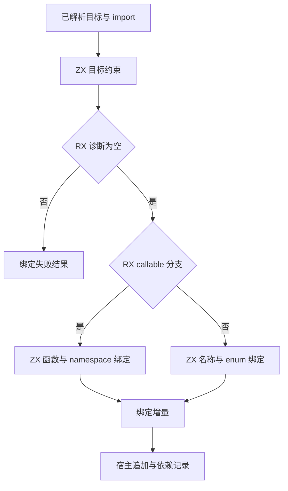
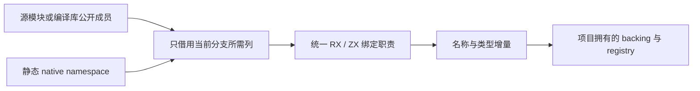

# 导入绑定独立收口

## Intent：最终目标

将已实施的项目导入绑定迁移收口为可独立构建、核验和提交的完整职责。继续由 RX 表达约束检查、失败短路和 callable/type 分支，由 ZX 完成名称匹配与绑定增量；不将其他会话的共享构建或 genz 改动混入提交。

## Data：可用证据

- 初始接手基线没有 `modules/project.zig` 与新 `modules/binding` 路径，这些业务改动属于本任务；project 当前 diff 仅两个导入绑定分支。
- 新代码为 `binding.zig` 及目录内 `context.zig`、`input.zig`、`seed.zig`、`bind.rx`、`model.zx`、`constraint.zx`、`aliases.zx`、`functions.zx`。
- 既有阶段记录：原指针接口三个专项通过 67 个 Zig 测试和 9 个编译包运行用例；值接口接回后 module-records 的 10 个测试通过。
- 既有固定语料：1,291 个源码、42 个入口，1,212 个产物逐字节一致；值接口冷生成 114.438 秒对基线 115.214 秒，热生成 76.440 秒对约 76.495 秒。这些旧计时不覆盖完整冷 Zig 构建和单模块修改。
- 当前 HEAD 的构建模块仍手工列举 ParserModules/Sources；只提交工作树 entries 中的一行不足以独立构建。

## Edges：边界与限制

- 以可空字段事实提交后的 HEAD 为独立基线，不创建 Git 分支，不改写其他会话工作树。
- 排除接手时已有的 `compiled/execute.rx`、`compiled/validate.rx`、`semantic/merge.zig`、genz 与共享构建改造。
- `source_signature/host.zig` 的 native.types 调整属于可空字段投影，不是本块导入绑定依赖。
- 保留 source 的 pure-type 约束、compiled 的公开类型规则、native 默认 namespace 展开，以及既有诊断文字和位置。
- 宿主仍负责解析目标、追加增量、生命周期及 registry；seed 仍是明确的过渡依赖，不将本块称为项目完整自举。
- 不新增测试，不运行全量测试，不触发 CI 或发布。

## Answer：实施与成功标准

1. 在隔离源码副本中叠加 10 个业务文件，补齐 entries、parser、compiler 三个构建文件的最小接线。
2. 入口为 `zx/modules/binding/bind.rx`，名称 `project_binding`；因名称绑定使用通用 `std:integer`，沿用 HEAD 原生调用入口的 bundle 与 `project_binding_abi` 静态类型接线。
3. 运行既有 module-records、native-declarations、compiled-packages 三组专项，确认源模块、编译库及 native 路径和分配失败行为。
4. 用同一工具链、输入和缓存条件比较冷构建、热缓存及单模块修改成本；旧生成计时不能替代新证据。
5. 核对固定产物、实际传递依赖和自有语义归属，仅提交并推送本块变化，完成后移除对应待办。

## 独立验证记录

- 首次专项在生成阶段报 `NativeRequiresBundle`，未执行测试。原因是误将使用 `std:integer` 的入口按无原生调用的普通入口接线。
- 已在隔离副本中补齐 ABI 生成声明和静态模块导入；业务源码不变。第二次专项已通过生成与 CLI 编译，但两个编译包 Node 入口因副本缺少 `yaml` 未执行到断言；已接入仓库现有 `packages/test/node_modules`，解析确认成功。本轮 67/67 个 Zig 测试通过；编译包专项恢复依赖后单独重跑，36/36 构建步骤、9/9 拒绝用例与 4/4 运行用例全部通过。业务代码在此期间逐字节未变。

## 性能测量口径

两份副本都使用 `zig build -Doptimize=ReleaseSafe -j2` 编译并安装完整 CLI。冷构建指各自独立且初始为空的本地构建缓存；共用既有工具链全局缓存，不宣称无全局缓存的机器冷启动。热缓存不改源码；增量在两份临时副本中给同一 leaf 诊断文字追加句号，记录修改前后哈希，正式工作树不变。专项全部结束后才运行计时，避免并发竞争。

## 首轮性能与未满足项

完整 CLI 冷构建基线 311.168 秒、迁移版本 310.831 秒。默认安装还包含 `zx-example`；首次热构建基线重新执行该示例的生成与约 6 秒的 Zig 编译，因此 7.003 对 0.410 秒不能算作绑定迁移收益。三轮稳定热缓存基线 0.357–0.444 秒、迁移版本 0.346–0.427 秒，范围重叠。

单模块变更首轮为 236.134 → 236.817 秒；交换顺序后为 235.921 → 236.332 秒。两轮迁移版本都略慢（约 0.29%、0.17%），该未收缩版本未按“构建无退化”收口。

已在隔离副本中收缩 `aliases.zx` 的循环状态：从完整 Request 改为只携带 names、exports、type_kinds、check_enum、native 与实际可变结果。移除循环不用的 members、顶层 span 与 type_only 描述符，保持读取原表和诊断顺序。收缩版本冷构建 290.587 秒，低于初始基线 311.168 秒；相邻增量 235.600 秒对基线 236.385 秒，热缓存 0.412 秒对 0.406 秒，落在既有稳定波动范围内。正式工作树已接回这一局部修改。已完成 ZX/RX 格式检查、Zig fmt 与仓库语义空行检查；四处 Zig 文件仅规范空行，非空行逐字节相同的证据单独记录。最终定向回归通过 44/44 构建步骤、12/12 Zig 测试、9/9 编译包拒绝用例与 4/4 运行用例。原生类型导入仅在副本中临时添加入口以单独运行既有测试，验证后已恢复；没有新增测试或提交测试接线。

生成入口文本由 65,098 字节、1,103 行变为 66,019 字节、1,107 行；并未缩短。状态职责收缩、描述符表示与优化器工作量不是文本行数的同义词；只能报告当前计时观测，不把约 20 秒冷构建差异全归因于这一局部修改。

## 自我批判

职责提取和生成产物相同不足以证明提交独立可用，更不能证明构建不退化。本轮独立副本消除了未提交构建改造的依赖，并分别验证生成、完整构建、增量和资源行为。宿主布局转换及 seed 仍未完成自举；有限次数的性能观测不代表所有输入和机器都必然加速。
