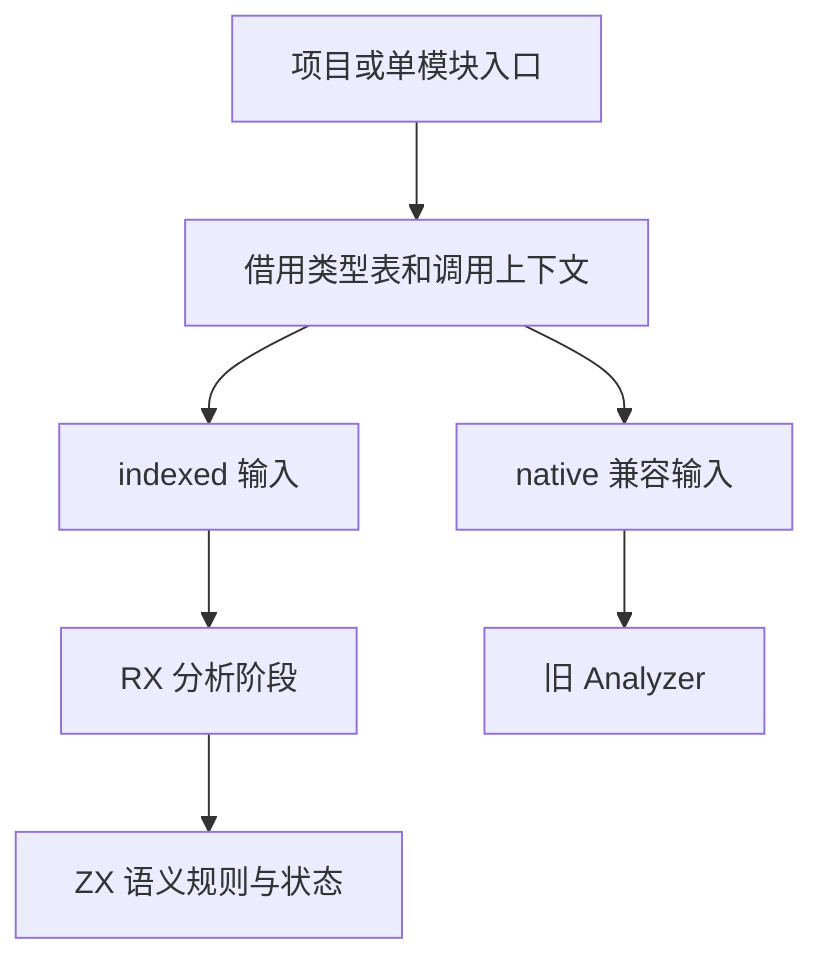
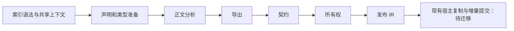

# 完整自举接续执行计划

## Intent：最终目标

完成当前用户指定的七块剩余实现，并以正式传递依赖和真实三阶段自编译共同验收。当前会话目标已建立，完整用户原文保存在 `docs/user_request.md`。

## Data：可用证据

- 接手 HEAD 为 `79cfb5811`；已有大量未提交实现和十个暂存测试、记录文件。
- 已读取“复核编译器生成架构问题”的最终交接：共享生成与缓冲变体已验证；Printer 有同版本 1197 个产物逐字节一致证据，但正式入口未接线。
- 已读取测试会话最近进度：共享摘要专项两模式各 54 次执行通过，尚在提交检查。
- 本机 Zig 为 `0.17.0`。既有 `zxc_zig` 保留分支为 `515828e7b`，不修改。

## Edges：边界与限制

不覆盖已有工作，不提交其他会话暂存文件。不运行全量测试、不新增测试。已有验证均是交接证据，不冒充本轮验证。完整 genz 状态、Lower、Analyzer 与项目编排仍未迁移；Printer 接线不能代表完整自举。

## Answer：执行顺序与成功标准

1. 冻结接手文件摘要及差异，建立归属；查明构建和真实依赖。
2. Printer 由另一会话负责；用户明确提醒后，本轮新增的五文件接线已逐项撤回并与接手摘要核对一致。本会话转向主分析器及项目流程，不重复实现 Printer。
3. 按清单推进分析器、项目流程、genz 状态与 Lower、其余规则；每块先定义 RX 阶段和 ZX 职责。
4. 闭合产品边界、平台发行和缓存测量，再执行固定输入的完整三阶段验收。
5. 完成块仅提交本会话负责且独立可复核的修改，英文规范提交并推送；依赖尚未提交时先保留明确阻碍记录。

## 自我批判

接手状态复杂，不能以“会话已收尾”推导所有未提交文件归本任务所有。先保存基线，后续只对本轮增量负责。主分析器上下文仍是过渡宿主边界；移除旧 Analyzer 的数据结构依赖不代表结果发布、native 兼容 API 或完整状态模型已完成自举。
