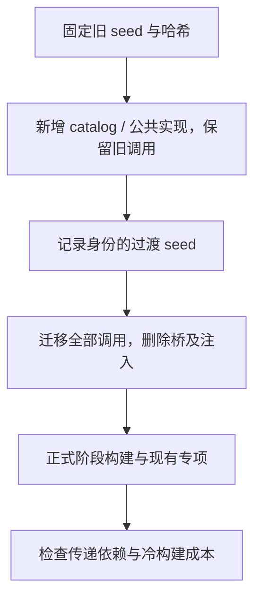

# 数值标准契约迁移

## Intent：最终目标

将整数宽度转换、浮点转换与解析表达为应用可直接使用的通用标准契约，移除编译器专用 integers/floats 桥及其注入。实现直接静态调用 Zig 通用能力，不保留编译器语义回调或专用运行库。构建成本不得退化。

## Data：可用证据

- 当前桥只包含三项整数转换和五项浮点转换、判定、解析；没有编译器类型或状态参数。
- compiler/core 的调用引用 zig:integers 与 zig:floats；已有 standard catalog、声明分析、静态模块和发行打包机制可直接承载公共模块。
- 现有转换使用 std.math.cast、@floatCast、std.math.isFinite 和 std.fmt.parseFloat。parse32 直接解析 f32，不能以先解析 f64 再缩窄替代。
- 固定旧 stage0 的 catalog 嵌入二进制，不能直接解析新增的 standard specifier；新构建的 frontend 则从当前磁盘 catalog 获取声明。

## Edges：边界与限制

- 只提供现有明确需要且语义通用的八项能力，不枚举全部数值类型组合。
- checked integer narrowing 越界返回 IntegerOverflow；浮点精度转换保留 Zig 的数值语义，通用解析不混入 ZX 字面量诊断。
- 新 standard 实现只使用原生数值、字节切片、optional 和 error set，不依赖新增的 generated ABI 类型。否则旧 seed 的 ABI 不能用于加法阶段。
- 先保留旧 imports/桥构建带新 catalog 的过渡 seed，再迁移调用并删除桥。明确记录新旧 seed 身份，不沿用旧 seed 验收结论。
- 构建清单和 parser 接线含其他会话改动；只保存并修改本块所需片段，不整文件提交其他会话代码。
- 不新增测试，不运行全量测试或 UI；使用现有相关专项和固定输入构建成本对照。实现与依赖闭包完成前不宣称已迁移。

## Answer：交付与成功标准

交付包括公共声明及使用文档、全部调用迁移、专用桥删除、seed 来源和性能证据。正式闭包不得再出现这两个专用模块；standard 实现不得引用编译器目录。最终三阶段及其他编译器专用状态仍按总清单验收，本块不替代完整自举。

## 自我批判

改名或移动路径本身不证明边界正确。只有公共契约可独立供应用使用、实现不含编译器专有语义、旧注入实际移除，才算完成这一能力边界。加法阶段仍使用旧桥，必须明确标为过渡状态。

## 实施证据

过渡 seed 构建通过 12/12 步骤。旧 seed SHA-256 为 `cc9926932c5738f85b985d59ef22faf64b165593f4a0a23cba85039d5f59ae6f`，过渡 seed 为 `d312bab84c8380b1e8ea5036c652641a92901c3288e94e86181d5455c832f8e5`；使用 Zig 0.17.0、ReleaseSafe、-j2。完整源码与配置哈希另存本地忽略记录。声明文件 formatter 当前不接受 declare-only 文件，未把该失败算作格式通过；公共声明已由真实 catalog 构建解析。

共迁移 340 个 ZX 文件：319 个已跟踪文件、一个先前未提交的绑定文件、20 个另一会话未跟踪的 Printer 文件。后两组只更新数值 import，继续留在工作区，不把其实现纳入提交。曾优先尝试 grit；一个 ZX 文件的结果误删无关 const，精确 diff 断言在写入前拦截。最终以真实基线逐文件核对，仅改变两个 import specifier。

当前工作区已删除四个桥文件和统一清单/parser 注入；源码与正式构建接线未再检出旧 specifier。两个标准实现与原有通用函数体保持一致，不引用 compiler、generated ABI 或自有状态。

为隔离另一会话的构建重构，另构造 HEAD + 本块变更的提交候选：旧 parser 接线改为同一公共 standard 模块，旧 generate_parser 的专用接口数组删除，通用 interfaces 结构保留。候选不包含未跟踪统一清单、Printer 或绑定实现。该候选将按 HEAD 原有入口验证，与当前工作区的固定 seed 测量分别记录。

隔离提交候选已通过 `test-expression-bindings`：24/24 步骤、40/40 用例。当前统一构建版本通过 12/12 阶段构建；第一轮相同 seed 的冷构建为 baseline 184.415 秒、after 185.530 秒，热缓存均为 0.172 秒，约 0.6% 的差值尚待反向复测。

迁移后的 bootstrap SHA-256 与过渡 seed 完全相同：`d312bab84c8380b1e8ea5036c652641a92901c3288e94e86181d5455c832f8e5`。这是固定源码状态和配置下，公共目录相同而桥调用方式不同的两份可执行产物逐字节等价证据；不把它扩展为所有目标平台、全部公共输入或完整自举的证明。现有浮点运行时专项待成本复测结束后执行。

反向复测冷构建为 baseline 184.826 秒、after 186.555 秒。两轮都观察到约 0.6%–0.9% 增加，尚未满足构建时间不退化的门槛。首轮 peak RSS 为 baseline 16,455,401,472 bytes、after 15,397,949,440 bytes；不能以单轮内存降低替代时间要求。当前迁移保留为未提交工作，浮点专项仍在执行，接下来直接对固定生成命令采样，辨别 infer/emit/Zig 编译成本，再决定优化或撤回。

当前共享工作区的浮点专项已结束：312/312 步骤、43,664/43,664 用例通过。它包含另一会话未提交的构建及 genz 改动，因此与隔离提交候选的 40 个 expression 用例分开记录；不代表全量测试。当时性能门槛仍未通过，保持未提交，后续取舍见下节。

## 最终取舍与提交核验

后续定位并消除了宿主 small 标准运行时的逐字节复制热点，详见《生成器内存复制性能分析》。同一快速 seed 下，迁移前冷构建 107.59 秒，迁移后 108.54 秒：不能宣称数值迁移本身提速或零成本。公开 standard namespace 增加少量成员路径元数据，新声明同时标明 concurrent；只读调用链核对未发现按 import 重复解析接口的问题。

本块将公共数值契约与宿主标准运行时配置一起交付。相对于原基线 184.42 / 184.83 秒，组合后的 108.54 秒减少约 41%；数值迁移约 0.9% 的独立成本明确保留。这是在整体构建时间明显降低的前提下移除专用桥，不用提速结果掩盖剩余成本。

HEAD 加本块变更的隔离提交候选通过 Debug `bootstrap-parser`，23/23 步骤，其中实际以 fast 编译工具链标准对象，再链接 small generator。候选继续保留 HEAD 原有构建入口，只更新其数值接线，不包含另一会话的统一构建、Printer 或绑定实现。既有 expression 40 个用例和浮点 43,664 个用例的验证范围仍按上文区分。

当前工作区 bootstrap-stage 的一行快速运行时接线依赖另一会话新增目标，留在工作区等待其构建提交；本块提交中可独立使用的 parser generator 接线已通过上述隔离构建。完整状态与自有规则迁移、三阶段传递依赖验收不在本块内宣称完成。
