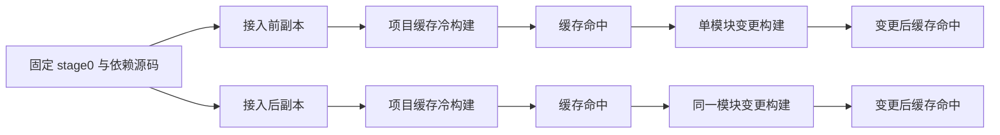

# 原生分析接入的构建成本对照

## Intent：最终目标

核实原生 AST 分析及签名接入前后，实际 bootstrap-stage 构建成本是否退化。分别记录项目缓存冷构建、缓存命中、单模块变更，避免用生成阶段耗时代替整体构建。

## Data：可用证据

两份固定源码副本由此前绑定值 ABI 副本及当前工作区构造；core、dsl、genz、lint 完全相同。compiler 只有本块的 50 个既有文件变化及 11 个新增文件。先前诊断副本的 unify 调试输出已在测量副本中用相同正式实现替换，不影响原副本或工作区。

逐文件哈希、差异集合和 stage0 哈希保存在忽略的 `原生构建成本副本.json`。两份副本均不创建 Git 分支，运行相同 Zig 工具链、ReleaseSafe、`-j2` 及固定 stage0。bootstrap 产物维持既有 ReleaseSmall。

## Edges：边界与限制

“冷”指两份副本各自无项目 `.zig-cache`，全局 Zig 缓存保留；不宣称机器或操作系统完全冷缓存。同机仍有其他会话负载，墙钟差异只能结合多阶段数据解释。只运行 bootstrap-stage，不启动测试、CI 或发行。比较的是相同共享构建实现叠加本块修改，不将其他会话共享构建成果计为本块提速。

单模块变更只在副本内将 analyzer/expressions/leaf.zx 的同一条诊断文本添加句号，保持源码合法且确实改变生成内容；不是新增测试用例，不进入提交或工作区。记录第二次缓存命中，以区分首次命中的扰动。

## Answer：交付格式与成功标准

数据流为固定源码与配置 → 生成的 Zig → Zig 编译 → bootstrap 可执行文件。记录各阶段命令退出状态、墙钟、资源报告及 build summary。只有全部成功才比较成本；失败先修复，不用不完整结果下结论。

## 执行结果

所有 8 次构建成功，均为 12/12 步骤。

| 条件           |     接入前 |     接入后 | 本轮差值 |
| -------------- | ---------: | ---------: | -------: |
| 项目缓存冷构建 | 183.917 秒 | 188.396 秒 |   +2.44% |
| 缓存命中       |   0.175 秒 |   0.178 秒 |   +1.71% |
| 单模块变更     | 143.680 秒 | 146.920 秒 |   +2.26% |
| 变更后缓存命中 |   0.170 秒 |   0.173 秒 |   +1.76% |

本轮冷构建和单模块变更均观察到约 2% 的耗时增加；不能称“整体构建无退化”。同机存在并发负载，单轮数据不足以断言全部差值来自本块，但该观测保留。缓存命中约 0.17 秒；单模块变化仍需约 2 分 20 秒，当前流水线仍会重复推导、生成与 Zig 编译，这项未从待办移除。后续内存生命周期优化另行测量，不混用两块结果。

日志与资源报告：`原生构建成本-before/after-*.log`，各阶段时间与退出状态见对应 JSON。

## 自我批判

这份证据只覆盖编译器 bootstrap-stage；应用、统一库及完整三阶段自编译仍需独立验收。单次时间差不能证明普遍性能改进，尤其不能掩盖冷构建和单模块变更的额外成本。
