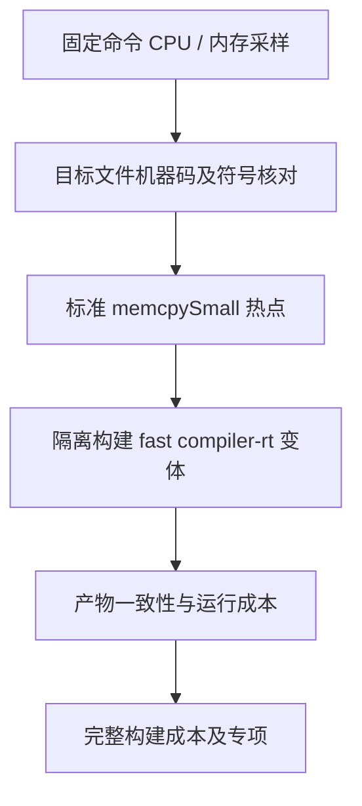

# 生成器内存复制性能分析

## 隔离验证进展

- 同一份数值迁移副本构建快速标准对象和 bootstrap，通过 14/14 步骤；对象编译约 2 秒。
- 目标文件和最终可执行文件均经反汇编确认使用快速 memcpy；最终符号表只有一份 memcpy/memmove/memset。
- 42 入口清单首次成功运行 39.49 秒；原版顺序重测 115.03 秒，生成阶段下降约 65.7%。1,217 个生成文件在两次原版对照中均逐字节一致。
- 首次直接运行因工作目录错误返回 FileNotFound；清单包含相对 core/lint 路径。改回原构建目录后成功，失败不计入性能数据。
- 仓库新增 build/compiler_rt.zig，只对 small 根模块配置工具链自带 fast 对象，bootstrap 和 parser generator 共用。其他优化模式保留原工具链默认行为。使用同一 resolved target、PIC 和 libc 设置，明确禁用 builtin 重写与重复捆绑。
- 快速 seed 驱动的完整冷构建通过，耗时 108.54 秒；原标准运行时两轮为 185.53 / 186.56 秒。新 bootstrap 与快速 seed 的 SHA-256 同为 `6dfc4306037edc1cca0f52f55ed3a107c4231a55724e33ae14b05877e597cb2a`。两轮配置差异正是 seed 及构建目标使用的标准运行时，不把结果解释成数值迁移单独带来的收益。
- 目前只完成 x86_64 macOS 原生验证；不宣称其他平台或完整三阶段自举通过。数值迁移是否独立增加成本仍用同一个快速 seed 另行对照。

## Intent：最终目标

从实际运行热点消除构建成本，支持数值标准迁移及后续真实自举。优先验证标准工具链配置，不增加 zxc 专用运行库，也不以放弃运行时安全或改写业务结果换取速度。

## Data：可用证据

- 固定数值迁移后的 42 个入口、过渡 seed 和源码直接运行生成器，生成缓存为空。该轮同时存在其他编译进程，仅用于归因，不作为无争用性能对照。
- 阶段摘要：infer 33,086 ms、emit 89,434 ms、write 58 ms；1,131 个函数文件、1,174 个缓存生成单元。
- 在 15/50/85 秒各采样 3 秒，间隔 10 ms。普通 binary 已裁剪符号，直接显示的 main 地址偏移不能用于源码归因。
- 使用同次构建的 zxc-bootstrap_zcu.o 符号表恢复函数地址。核对 6,795,446 字节 text：除了正常 relocation 字节和 31 处 TLV relocation 对应的 MOV→LEA 等长链接松弛外，机器码布局完全相同。未重新编译或替换采样二进制。
- 15 秒点：memcpy 独占 87 个样本，inference.types.root 独占 77 个样本，总主线程样本 289。
- 50 秒点：memcpy 独占 267/285 样本；其调用树主要经过 iteration_buffer.analysis.expression。
- 85 秒点：memcpy 独占 240/288 样本；调用树包含 iteration_layout.identityFree 等输出分析路径。
- 本机构型 sizeof：Program 2,304 bytes，ExpressionTable 1,408 bytes，ExpressionRow 96 bytes，TypeTable 128 bytes。大描述符按值传递可能放大复制量，但尚未单独验证改变 receiver 的效果。
- Zig 0.17.0 自带 compiler_rt/memcpy.zig 明确在 builtin.mode.small 时选择 memcpySmall；其实现逐字节复制。现有 bootstrap/generator 根模块刻意使用 small，以降低 LLVM 编译成本。

## Edges：边界与限制

- 三个短采样不能推断整个运行的精确占比，也不能将全部 memcpy 都视为底层数据深拷贝。
- 数值迁移的两轮冷构建仍略慢，不能用热点发现代替性能门槛通过。
- 首先在隔离源码副本验证 fast 标准 compiler-rt。使用工具链原文件，不复制或修改标准库，不实现自有 memcpy，不改变用户源码语义。
- 标准对象与宿主工具的 target、CPU、backend 必须一致；禁止重复捆绑 compiler-rt。
- 后续仍需检查平台链接、生成产物一致性、既有专项和完整冷构建。不得将本机证据扩展为全部平台已验证。

## Answer：验证与交付标准

成功标准是实际时间改善且生成行为一致。若仅标准运行时配置不足，再依据栈与复制尺寸处理具体所有权和视图传递，不机械改动所有公共 IR API。

## 自我批判

本轮比按源码尺寸猜测更接近根因，但“热点集中于 memcpy”仍不等于标准运行时切换必然净收益。标准对象的编译和链接成本、不同目标的实现选择都需要实测。当前只有诊断证据，尚未宣称修复。
