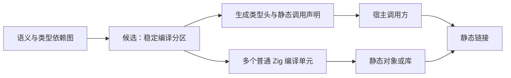

# 生成模块静态编译可行性

## Intent：最终目标

辨别单模块修改后仍需较长 Zig 编译时间的原因，评估独立静态编译是否值得作为后续优化方向。本记录不代表已选择分区方案，也不新增本轮实施范围。

## Data：可用证据

- 独立提交基线 `9bbd50b6e` 的 CLI 对照中，单个 ZX 模块修改仍需约 236 秒；这是完整 CLI 构建数据，不能与仅构建 bootstrap 工具的时间直接比较。
- 当前工作树的 `shared_generation.zig` 共享推导及分文件生成缓存，`shared_output.zig` 输出公共类型、函数与入口。它们来自其他会话的未提交工作，不能视为已经提交的基线能力。
- `parser.shared()` 创建 Zig Module，各入口通过 import 引入实现，最终仍进入同一个编译单元。
- CLI 使用 `compiler.module("compiler")`。已有 `zxc_compiler` library 声明不等于 CLI 通过静态外部符号消费它。
- 独立编译 compiler_rt 的既有用法不能证明生成的编译器算法已经具备跨编译单元 ABI。

## Edges：边界与限制

- 不修改或重做其他会话的共享生成、产物组织及 genz 工作。
- 不能承诺某种分区数量或加速幅度；需要真实构建证据，不能只证明链接成功。
- 继续保持普通 Zig、静态链接、调用方 allocator 和输入内容零复制，不引入专用 runtime、动态加载或运行时注册。
- 若实施，边界应由通用生成器产生，不手写 analyzer、IR 等专用语义桥。
- 跨编译单元的内联和整体优化可能变化；需要同时评估冷构建、局部修改、产物体积与运行成本。

## Answer：结论与后续核对条件

把整个 generated 改成一个库，只能帮助纯宿主修改复用该库，不能自动解决 ZX 修改引起的整库重编。要局部重编，需要多个独立 Compile 单元、稳定的共享依赖归属，以及不重新导入实现的跨分区调用。

必要的技术边界尚未实现：

| 边界         | 必须保留的契约                                        |
| ------------ | ----------------------------------------------------- |
| 类型与常量头 | Input、Output、shape 和 buffer_lanes 仍可在编译期导入 |
| 错误集合     | 生成明确的状态映射，不能假定独立单元的错误数值相同    |
| 内存         | 使用调用方 allocator；结果仍由原拥有方释放            |
| 缓冲调用     | 保留 executeBuffered 的容量、started 状态及复用语义   |
| 共享算法     | 不能按入口复制整个依赖闭包，递归关系也不能机械切开    |
| 失效范围     | 共用 types.zig 的变化可能使全部分区失效，需要实际核对 |

## 更小的实验候选

本机 Zig 0.17.0 的 `std.Build.ExecutableOptions` 提供 `use_llvm`，`use_lld` 为独立选项。仓库尚未使用非 LLVM 后端构建宿主；只对 compiler_rt 明确指定 LLVM。可先在隔离副本中选择一个宿主工具实验，保持业务代码、target、优化模式和链接器不变，避免直接进入较大的静态 ABI 改造。

该选项作用于 Compile step，不能按导入 Module 分别选择。切换 CLI 宿主不等于切换用户应用的代码生成后端，但可能改变编译器自身运行性能，因此必须同时核对生成时间、真实产物和行为，而不是只比较工具编译时间。当前 parser generator 的 root 优化配置还需单独记录，不能把 root 优化模式变化混算为后端收益。

本机标准库包含针对 stage2_x86_64 的不同 SIMD、加密和数学路径；接口存在不代表所有平台及本项目代码可用。本轮仅确认实验能力，没有执行或采用该方案。

## 自我批判

共享生成会减少重复语义分析，也可能减少重复生成代码的编译量，不能说它只影响前端时间；本记录只确认它没有建立独立 LLVM 编译边界。分区有潜在收益，但也会增加 ABI 与依赖管理成本，目前只能作为候选，不能用架构图代替性能结论。
