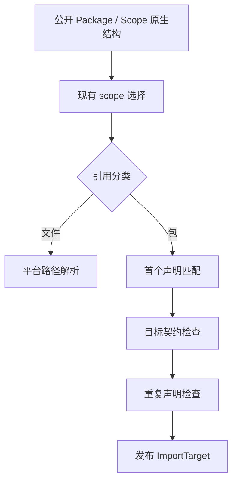
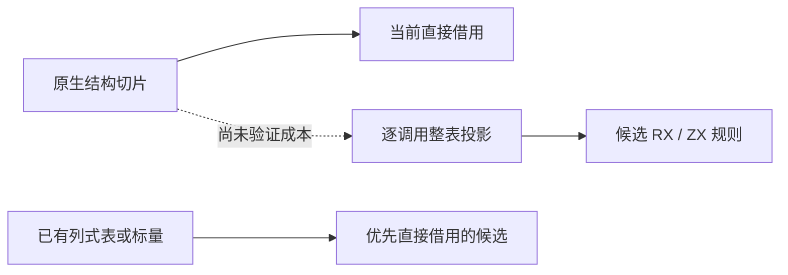

# 项目规则输入边界核对

## Intent：最终目标

继续迁移编译器自有规则，但先确认输入与状态边界，避免为几十行规则增加反复转换和临时分配。构建性能优先，RX 负责真实阶段编排，ZX 承担内聚算法。

## Data：可用证据

- 导入绑定已独立提交 `9bbd50b6e`，详细验证见 [导入绑定独立收口](导入绑定独立收口.md)。
- `project.resolveModuleTarget` 处理当前 package scope、文件引用和依赖声明；候选为声明选择与 source/compiled 目标校验。
- `Package` 是公开原生结构，包含 specifier、entry、可空的 compiled Target；当前实现直接遍历 `[]Package`。
- `package_scope.owner` 也直接遍历公开 `[]Scope`，调用接口没有 allocator；不能把新增表转换分配隐藏在现有纯查询里。
- 声明选择的既有错误顺序是先验证首个匹配声明，再在后续匹配时报告重复。不能先报告重复而覆盖更早的无效声明错误。

## Edges：边界与限制

- 不修改其他会话的共享构建、compiled 编排、semantic merge 或 genz 工作。
- 不为这次局部迁移新增缓存、专用原生访问器、解释层或动态派发。
- 不改变公开 Package/Scope 的字段与生命周期来适配生成接口。
- 不把平台路径规范化混入语言规则，也不宣称重新安排路径分配与诊断的顺序完全等价。
- 不新增测试，不运行全量测试，不调用浏览器，不触发 CI。

## Answer：决策与下一步

依赖声明选择暂不进入实现：当前没有已验证的直接借用生成接口，每次导入重新投影整表的成本缺乏依据，且会扩大宿主适配。此职责仍在完整自举待办中。

下一轮只读检索优先检查已经持有列式表或标量输入的剩余规则，排除纯布局适配和已迁移规则。候选必须具备完整语义职责、明确阶段边界、现有回归入口与成本对照方案，确认后再实施。

## 后续核对结果

主分析器入口和 IR validation 附近的正式规则大多已有 RX/ZX 实现；`ir/error_contracts.zig` 只在 seed 路径使用，不能当作正式遗漏再迁移。`verified_prefix` 涉及原生 backing 指针身份与字段表示等价，不能替换成内容比较后宣称保持相同信任边界。

core 原生表同时参与引导器构建，直接让其依赖当轮生成器结果会形成环。验证查询组装已完成候选核对，但因两轮增量成本退化而撤回，证据见 [验证查询组装迁移](验证查询组装迁移.md)。后续优先调查构建成本边界。

## 自我批判

这次边界核对不算完成规则迁移。避免一次不合适的适配，也不能成为长期保留原生规则的理由；最终需要通过统一状态模型或普通语言能力消除转换边界，而不是将待办重新命名为平台代码。
