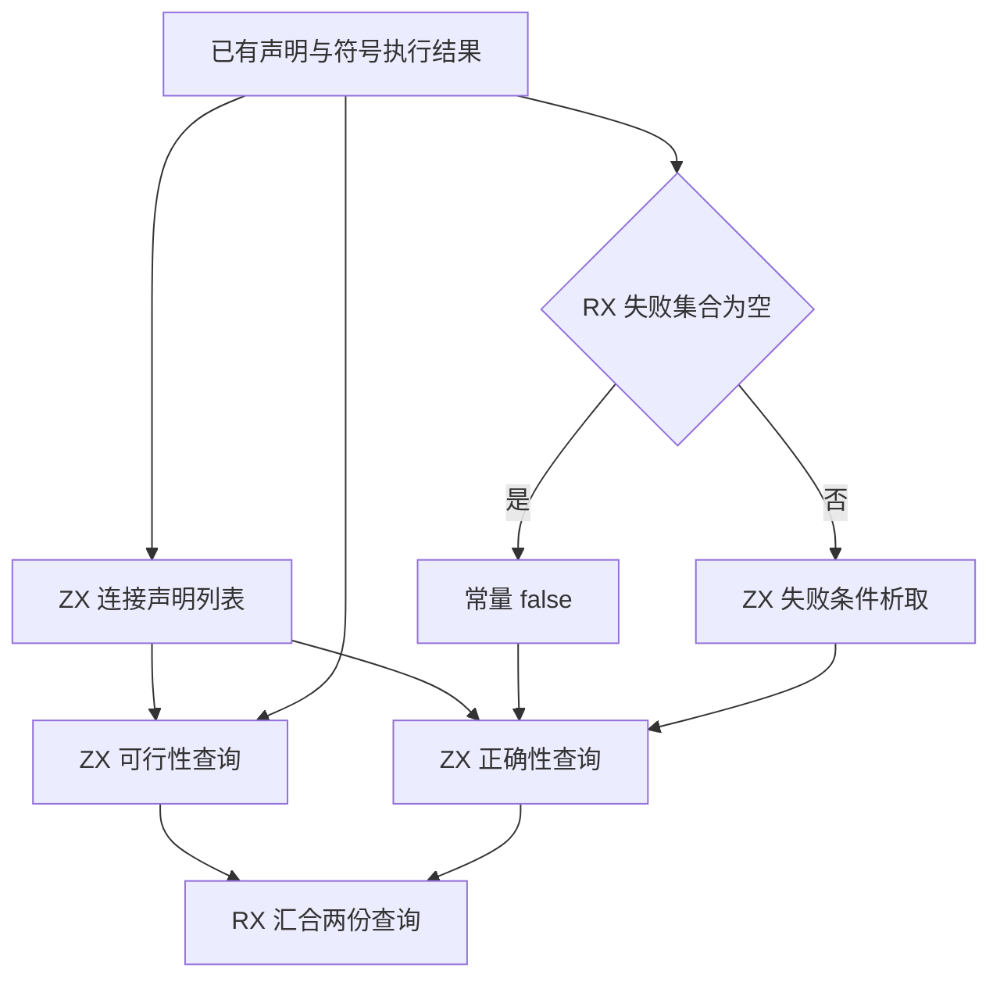
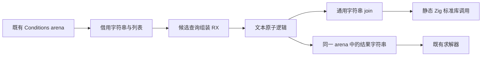

# 验证查询组装迁移：未采用

## Intent：最终目标

评估将 SMT 查询组装迁入统一 RX/ZX 模块，并保持原有行为、借用与构建成本。**候选已撤回，未计入自举完成项。** 业务源码和对应标准接口已恢复；候选、日志与校验数据在本地保留。

## Data：可用证据

基线为 `9bbd50b6e`。候选在独立副本中补齐 HEAD 所需接线，不依赖工作树中其他会话的共享构建改造。

- 正式专项通过 39/39 构建步骤、3/3 Zig 资源用例，以及 20 个基础 CLI、8 个公开入口、74 个枚举场景。使用现成 Z3 5.1.0，通过既有 ZXC_TEST_SOLVER 指定路径。
- seed 专项通过 24/24 构建步骤、3/3 既有资源用例。临时副本只保留该用例的构建接线，结束后恢复完整构建文件。
- 复用未修改的 20 个基础 verification 场景，分别调用两侧 CLI；45 份 SMT 文件及退出状态完全相同。
- 正常文本、空失败集合、换行、声明顺序和结果拥有关系通过源码复核。定义字符串准备的分配次序不同，不能声称故障注入序号完全相同。
- 原有 72 个生成 Zig 文件逐字节相同，只新增查询与 ABI 两个文件，共 12,316 字节。
- 候选最终的 executeValue 及传递函数没有新增对象 create 分配；输入直接借用，且消除了旧实现的声明与定义中间拼接。

### 构建成本

同一工具链、ReleaseSafe、j2，两侧使用独立本地缓存并串行执行，保留已有全局 Zig 缓存。以下均为完整 CLI 安装构建，不与 bootstrap 工具或纯生成耗时混用。

| 项目           |       基线 |       候选 |
| -------------- | ---------: | ---------: |
| 首轮冷构建     | 293.371 秒 | 309.535 秒 |
| 反向冷构建     | 309.474 秒 | 292.048 秒 |
| 首轮单模块修改 | 236.269 秒 | 237.380 秒 |
| 反向单模块修改 | 235.213 秒 | 236.454 秒 |

冷构建结果有较大波动，不能据此认定稳定退化或加速。反向冷构建保留了双方相同的诊断文本改动，不是只改变执行顺序的严格复现实验。两轮单模块修改均慢约 0.5%，未达到不退化门槛。

稳定热缓存观测为基线 0.353–0.426 秒、候选 0.336–0.441 秒。另一次基线运行耗时 7.017 秒，其中 zx-example 实际重编译约 6 秒，不作为纯热缓存样本或候选收益。

独立运行生成阶段，候选 6.815 秒、基线 6.846 秒；这组数据未显示生成阶段新增耗时，也不能单凭它把完整增量差距精确归因到某个 LLVM pass。

## Edges：边界与限制

- 不新增测试、不运行全量测试、不调用浏览器、不触发 CI 或发布。
- 候选的普通字符串 join 只调用 Zig 标准库，没有 SMT 专用桥；正式路径始终调用 RX/ZX 产物。
- 旧 seed 原本公开 verification。候选曾保留 seed 专用旧组装，并让 frontend/compiler 共享同一个构建选项模块；不能通过缺失 generated 模块破坏这个入口。
- 初次编译发现多余 catch 分支不可达，后续改为直接 try。初次 Node 验证因 PATH 未提供 z3 失败，修正环境后既有专项全部通过。
- .d.zx 不属于当前 fmt 支持范围，声明接口由实际生成与编译验证；其他候选代码与文档格式检查通过。
- 本块从未覆盖符号执行、路径/契约求值、图状态、声明输出或 solver 的完整自举。

## Answer：结论与交付

候选功能正确，但两轮增量构建持续增加约 1.1–1.2 秒，当前未找到有依据的小范围修正。因此恢复原查询实现和标准库注册，删除本轮新增源文件，保留本地候选及实验记录。四个混合构建文件已逐字节恢复本轮接手哈希，其他会话内容保留。

下图描述经过验证但未采用的候选，不是当前源码架构：

## 自我批判

正确性通过、输入没有复制和生成源码较小，都不能替代构建成本验收。也不能通过改变优化参数、只保留更快的样本，或将候选重新命名为已完成模块来绕过门槛。

Graph 仍有原生 Definition 数组、驻留索引、调用缓存和可增长输出。直接转列或逐条构造字符串再 join 会引入额外成本；后续需要明确普通集合/输出能力及状态边界，而不是增加专用 Writer 桥。构建方向的独立编译与后端试验可行性另见 [生成模块静态编译可行性](生成模块静态编译可行性.md)，尚未实施。
