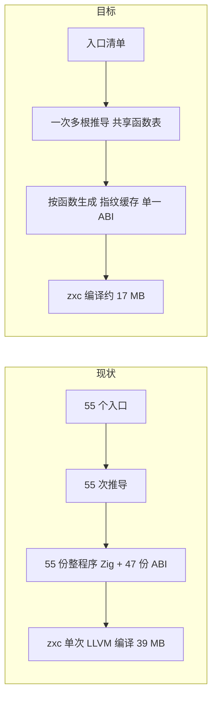

# zxc 编译器架构问题分析报告

## Intent：最终目标

在前两轮局部优化（增量校验、位集别名分析、列缓冲合并清理等，整体构建 149 → 74 秒）之后，从架构层面找出仍然严重影响编译速度和内存、或违反仓库设计原则（统一库、RX 编排 / ZX 原子、zero copy、自举完成标准）的结构性问题，给出按收益排序的改造方案。

## Data：证据与测量方法

- 生成产物：HEAD `4b0b01219` 的生成器对 55 个入口一次生成的 94 个文件（46 MB，其中函数代码 41.5 MB、ABI 类型文件 2.2 MB）。
- 跨入口重复：把每个函数体中由生成器按入口分配的序号（`function_N`、`zx_type_N`、`value_zx_type_N_<哈希>` 中的 N、局部 `operand_N`/`block_N` 等）去掉，保留类型名里的结构哈希；再按被调函数做划分细化，直到稳定。这样只有调用图同构、函数体逐字相同的函数才会算作重复，不会把调用不同函数的同形函数算进去。
- 存活性：对上一轮构建出的 Debug zxc 二进制执行 `nm`，统计各生成模块实际链接进来的 `function_N` 符号。
- 其他数据来自源码统计（`rg`/`fd`）及 [实施记录](../编译性能优化实施/实施记录.md) 的构建测量。

## Edges：边界与限制

- “预期收益”按生成代码体量线性估算；LLVM 时间不严格随源码字节线性变化，实施后必须用同口径重新测量。
- 存活性统计基于 Debug 构建的符号表，被内联的函数不会出现；Debug 下 Zig 基本不内联，误差可以忽略。
- 本报告只做分析，不包含代码改动；所列改造均需单独实施和验证。

## Answer：问题清单（按影响排序）

| #   | 问题                                       | 类别            | 关键证据                                                                                                   | 预期收益（估算）                     |
| --- | ------------------------------------------ | --------------- | ---------------------------------------------------------------------------------------------------------- | ------------------------------------ |
| 1   | 按入口整程序生成，没有共享编译单元         | 性能 + 统一库   | 生成函数代码 41.5 MB，唯一部分仅 18.3 MB，**重复 56%**；47 份互不相通的 ABI 类型                           | 生成代码减半；zxc 编译约 32 → 21 秒  |
| 2   | 同一函数的多个变体各自完整克隆函数体       | 性能            | buffered 54%、value 23%、regular 21%；value 与 buffered 只在缓冲传递处不同                                 | 在 #1 基础上再减约两成               |
| 3   | 14 个生成入口在 zxc 中完全未被链接         | 性能 + 冗余     | `ir_scopes`、`ir_contracts` 等 2.8 MB 每次构建都生成，只有 seed 分支的包装文件引用它们                     | 生成时间约 −6%，构建图减少 14 组输出 |
| 4   | 构建图手写硬编码、按位置参数对齐           | 可维护性        | 新增一个入口要改 4 个文件约 6 处；生成器用 `args[next]` 序号对齐 94 个输出                                 | #1 完成后自然消失                    |
| 5   | 种子与正式实现双轨，编译器每次构建编译两遍 | 性能 + 自举标准 | `generated_parser` 分支散布 37 个文件；`seed_*` 2,850 行 + `bootstrap/` 1,041 行重复规则；生成器编译 18 秒 | 日常构建省去种子编译；规则只维护一份 |
| 6   | 增量粒度是“全部源码 → 全部产物”            | 开发循环        | 一个 Run 步骤依赖整个 `src`；改任一 `.zx` 都会重生成 55 个入口并整体重编 zxc                               | 小改动只重生成受影响的函数           |
| 7   | RX 缺少声明式短路返回                      | 设计原则        | `compiled/validate.rx` 的 Switch 嵌套 7 层，另有 7 个文件 ≥ 3 层                                           | 编排可读；生成分支变浅               |
| 8   | 编译主流程与代码生成仍在手写 Zig           | 自举标准        | 项目推导、模块编译编排、genz 1.58 万行、5 个 host 桥约 1,100 行                                            | 非性能项，按自举标准逐项迁移         |
| 9   | 宿主边界输出逐表深拷贝                     | zero copy       | analyzer 每个文件的输出在 arena 中生成后，再用 `own` 拷贝五张表                                            | 未测量，预计较小                     |

### 1. 按入口整程序生成，没有共享编译单元（最大问题）

**现状**：`build/generate_parser.zig` 对 55 个入口各自独立执行“可达源码收集 → `project.infer` → `emitBundle`”，每个入口输出一个自带全部依赖函数的 Zig 文件和一个独立的 `zxc_abi` 类型文件。同一个 RX/ZX 函数被几个入口用到，就会被推导、生成、交给 LLVM 编译几次。

| 入口对                           | 后者函数代码中与前者相同的部分 |
| -------------------------------- | -----------------------------: |
| analyzer → expression_analysis   |           6.65 / 7.24 MB (92%) |
| ir_validation → native_restore   |           4.36 / 4.72 MB (92%) |
| ir_validation → compiled_library |           4.36 / 4.96 MB (88%) |
| zxc 实际链接的 41 个生成模块合计 |   39.0 MB 中唯一部分仅 17.0 MB |

IR 校验器在 `ir_validation`、`compiled_library`、`native_restore` 中各展开一份；analyzer 与 expression_analysis 几乎是同一套语义分析。ABI 类型同样重复：2.2 MB 的类型文件去重后只剩 0.8 MB。同一个 IR `Program` 在 47 个 ABI 中是 47 个不同的 Zig 类型，宿主只能靠 `ir/canonical/borrow.zig` 在 comptime 比较结构、再 `@ptrCast` 互转。

**违反的原则**：AGENTS.md 规定 zxc 的 lib 以统一模块及其公开接口为边界。现在实际上是 55 个各自封闭的小程序，宿主 Zig 在它们之间拼接。

**被忽视的现成能力**：应用构建路径已经有按函数生成并按指纹缓存的单元（`backends/zig/batch.zig` + `fingerprint.zig`，genz 的 `zx.modules.entry/function/types`，共享同一个 `zxc_abi`）。自举构建绕开了它，仍走整程序 `emitBundle`。

**改造方案**：

1. 多根推导：一次 `infer` 处理全部入口，得到共享函数表、55 个导出的同一个 `Program`。现有的已验证前缀与 `State.linked` 机制已经支持函数表跨步扩展。
2. 统一生成：复用按函数生成单元，所有函数和类型只生成一次，共用一个 `zxc_abi`，宿主只导入一个 `generated` 模块（或按语义目录分成少量分片）。
3. 宿主桥直接使用统一 ABI 类型，删除跨 ABI 的结构比较与指针重解释。

**预期**：zxc 链接的生成代码 39 → 17 MB。按生成代码约占 zxc 编译 20 秒线性估算，zxc 编译约 32 → 21 秒；生成阶段的 CPU 时间约 28 → 12 秒，峰值内存随之下降（8 个工作线程各自持有一份完整推导结果，当前峰值 1.85 GB）。

**对上一轮结论的更正**：[架构诊断复核](../编译性能优化实施/架构诊断复核.md)曾判定“跨入口重复不成立（4.4% / 10.6%）”。那次归一化没有去掉 `value_zx_type_<N>_<哈希>` 中的序号，所以把相同函数误判为不同。本报告用划分细化重新核对，结论改为**成立，而且是剩余后端成本的首要来源**。复核文档已同步更正。

### 2. 函数变体完整克隆

genz 对同一个 IR 函数按调用需求生成最多四个变体（`regular`、`value`、`buffered`、`buffered_pointer`，见 `genz/src/zx/functions/emit.zig`），每个变体都从头 lowering 一遍完整函数体。抽查 `function_191_value` 与 `function_191_buffered`，两者只在向被调函数传递缓冲的调用点上不同，其余逐行一致。

**改造方案**：只保留 buffered 一份完整函数体，value 变体改为“构造空缓冲、调用 buffered”的薄包装，或者把缓冲作为 comptime 可选参数，由生成器在调用点静态选择。需要先证明：空缓冲下 buffered 的所有权与结果和 value 语义一致（新分配、调用者拥有）。包装函数可以内联，不引入运行时成本。

**预期**：value 变体约占生成代码 23%，去掉其中的重复函数体后，在 #1 基础上再减少约两成代码和 lowering 时间。

### 3. 未被链接的生成入口

以下入口每次构建都生成（合计 2.8 MB），但 zxc 二进制中没有它们的任何函数：`ir_scopes`、`ir_contracts`、`ir_expressions`、`ir_body`、`ir_contract_tables`、`native_names`、`ir_tasks`、`native_export`、`ir_functions`、`ir_stores`、`nominal_lookup`、`type_lookup`、`native_type`、`ir_store_call`。

原因是正式路径已改由 `canonical/validation/validate.rx` 统一校验，而 `ir/scopes.zig`、`ir/tasks.zig` 等包装文件只被 `seed_validate.zig` 引用；在 generated 构建中，这些生成分支永远不会被分析。它们对应的 `*_check.rx` 也是单次调用的包装文件（135 个 RX 中有 25 个是这种形态）。

**改造方案**：删除这些入口及其 Sources / ParserModules 字段；如果测试包确实需要，就只在测试构建中生成。这一项成本最低，可以作为第一步。

**已实施**：测试包的 `native_references`、`function_effects`、`native_modules` 三个构建会直接测试这些校验器，所以没有删除，而是把它们移到单独的 `checks` 生成步骤，只有测试构建会触发。compiler 包以 `frontend_checks` 模块的导入表导出这些模块，测试构建把它并入自己的导入表。

- zxc 的正常构建不再生成这 14 个入口，主生成步骤输出从 94 个文件降为 66 个。保留的 66 个文件与改动前逐字节一致。
- zxc 链接的 4,118 个生成函数符号与改动前完全相同。
- 受影响的三个测试步骤 52/52 步骤、126/126 用例通过。
- 生成步骤约 8 → 7 秒。zxc 编译本来就不包含这些代码，所以不受影响。

### 4. 构建图硬编码

新增或删除一个生成入口，需要同步修改：

- `generate_parser.zig` 的 plain/typed 表，并靠 `args[next]` 的序号与输出位置对齐。
- `parser.zig` 的 `Sources` 结构（95 个字段）、94 个 `addOutputFileArg`，以及 `modules()` 中的接线。
- `compiler.zig` 的 `ParserModules`（49 个字段）和 47 个 `addImport`。

序号错位不会在编译期报错，只会把产物写到错误的文件里。完成 #1 后输出收敛为一个目录，这一层自然消失；在那之前，应改为由一张入口清单驱动全部接线。

**已实施**：新增 `build/entries.zig` 入口清单，生成器和构建脚本共用。生成器按清单顺序读取输出参数，数量不符时直接报错；构建脚本按清单循环创建输出，取代原先 94 个手写的 `addOutputFileArg`。`Sources` 与 `ParserModules` 的字段仍需手写，等 #1 完成后再收敛。

### 5. 种子与正式实现双轨

- 同一条规则在 RX/ZX 正式实现和 `seed_*.zig` / `bootstrap/` 手写种子中各维护一份，用 `parser_options.generated_parser` 在 37 个文件里做 comptime 分支。
- 每次构建都要把整个编译器编译两遍：先以种子形态编出生成器（18 秒），再以生成形态编出 zxc（32 秒）。
- 规则改动如果只改了一边，两条路径就会悄悄分叉；seed 校验与 canonical 校验需要分别接入 `verified` 前缀，就是这个问题的实例。

[自举完成标准](../../../rules/自举完成标准.md)只允许旧 seed 作为初始引导输入。

**改造方案**：把冷启动和日常构建分开：

- 日常构建用固定版本的 stage0（上一版 zxc，或固定的生成快照）直接从 RX/ZX 生成 stage1。
- 种子只用于从零引导，并按 stage1 → stage2 → stage3 一致性校验逐步删除 `seed_*`。
- `generated_parser` 分支随之退化为构建层的选择，不再散布在源码中。

### 6. 增量粒度

生成步骤以整个 `src`、`lint/naming`、`core/src` 为输入，任意一个 `.zx` 改动都会让 55 个入口全部重新推导和生成，再触发 zxc 整体重编（约 8 + 32 秒）。应用构建路径已有按函数指纹缓存，自举路径完成 #1 后应复用同一个缓存，让小改动只重生成受影响的函数。

Zig 的 LLVM 后端仍按整个可执行文件编译一个模块。进一步的选项是把生成库作为独立编译单元（静态库或对象文件）：宿主改动不再重编生成代码，两者也能并行编译。但这需要在统一 ABI 边界上使用 extern 布局，应先做最小实验，测出并行收益后再决定。

### 7. RX 缺少声明式短路返回

失败即返回的流程只能写成层层嵌套的 Switch：`compiled/validate.rx` 有 7 层，`compiled/execute.rx`、`canonical/validation/validate.rx`、`body/structure.rx` 等各 4 层。这违反了 RX 编排必须让流程一眼可读的要求。应在 RX 增加声明式短路（例如结果为假或诊断非空即返回），由编译器展开为普通 Zig 分支，不引入运行时。该项已有独立的会话卡片。

### 8. 编排仍在手写 Zig

以下部分仍属于自举标准中的“待迁移内容”：

- 编译主流程（`rx/analysis/project` 的推导、`module_compile`、`flow_compile`、并行任务）。
- 整个代码生成器 genz（1.58 万行）。
- 5 个 host 桥目录（约 1,100 行）。

它们不是当前的性能瓶颈，但不能宣称自举完成。迁移顺序应先完成 #1、#5，让 RX/ZX 产物成为单一事实来源，再逐步迁移编排。

### 9. 宿主边界深拷贝

`zx/analysis/analyzer/host/publish.zig` 对每个分析过的 ZX 文件，把 arena 中的 symbols、expressions、control、stores、contracts 五张表用 `own` 再拷贝一次到长期 allocator。如果让生成代码把输出直接分配在调用方给定的输出 allocator 上、arena 只承载临时数据，就可以省掉这次拷贝。未测量，预计收益较小，适合与 #1 的宿主桥改造一并处理。

## 目标结构

## 建议实施顺序

| 步骤 | 内容                                       | 风险 | 验证方式                                             |
| ---- | ------------------------------------------ | ---- | ---------------------------------------------------- |
| 1    | #3 删除未链接入口                          | 低   | zxc 二进制符号不变、CLI 构建通过                     |
| 2    | #1 多根推导 + 统一生成 + 单一 ABI（含 #4） | 中   | 同口径测量生成与 zxc 编译；`test-runtime` 交测试会话 |
| 3    | #2 变体合并                                | 中   | 先证明空缓冲语义等价，再看代码体量与运行时测试       |
| 4    | #6 自举路径复用函数指纹缓存                | 低   | 改一个 `.zx` 后只重生成受影响的函数                  |
| 5    | #5 stage0 引导并逐步删除 seed              | 高   | stage1/2/3 产物一致 + 依赖闭包检查                   |
| 6    | #7 RX 短路返回，#8 编排迁移，#9 输出直写   | 中   | 按语言特性与自举标准分别验收                         |

## 自我批判

上一轮复核用了过粗的归一化，把最大的剩余成本判定为“不成立”，并据此把工作重心放在后端微调上。这几项微调本身有效，但如果更早发现 56% 的重复，统一生成应当排在它们前面。本报告的重复率改用划分细化，只认调用图同构的函数，结论更可靠；但收益仍是按体量线性估算的，实施时必须重新测量。
