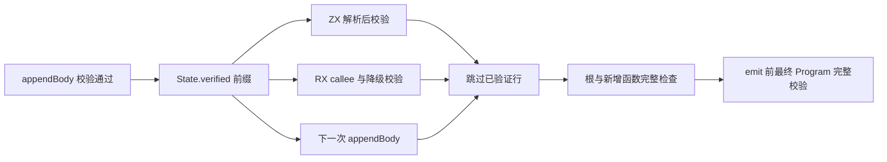
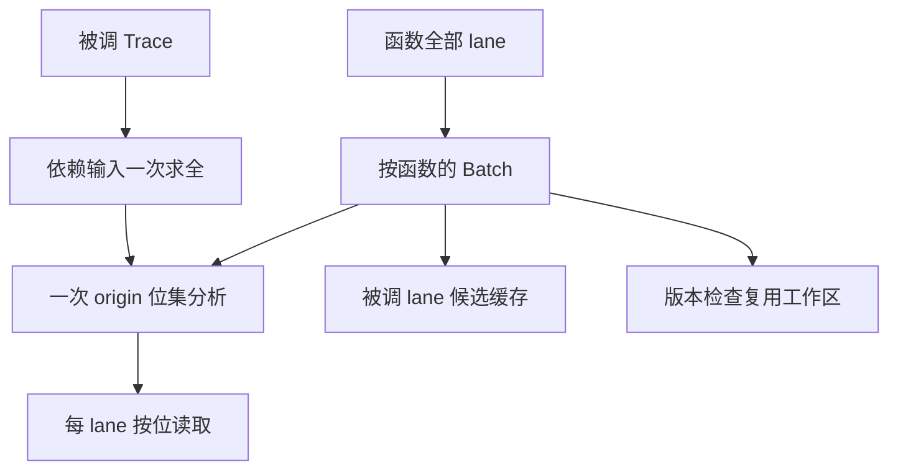

# 编译性能优化实施记录

## Intent：最终目标

依据[分阶段测量报告](../../2026-10-10/编译性能分阶段定位/性能测量报告.md)的定位，消除 zxc → Zig 阶段的两类重复工作：推导期重复全量 IR 校验，以及生成期逐 lane 的别名证明与整表状态快照。保持全部安全检查、生成产物、zero runtime 与 RX/ZX 自举路径不变。

## Data：可用证据

测量方式沿用报告口径：同一份 RX/ZX 输入，分别构建基线生成器（HEAD `f54339d37` 源码导出）与优化后生成器，均为 safe 模式，以 `/usr/bin/time -l` 记录。标准库 catalog 按当前 `standard/modules.json` 重新生成。机器上同时有其他会话的 Zig 编译，墙钟仅作本次观测。

| 主生成批次（55 入口、94 文件） |             基线 |                                        优化后 |
| ------------------------------ | ---------------: | --------------------------------------------: |
| 墙钟                           |        158.89 秒 |                                  **28.09 秒** |
| user / system                  | 153.46 / 4.25 秒 |                               26.11 / 1.63 秒 |
| 峰值 RSS                       |          3.89 GB | **1.38 GB**（加入工作区与循环复用后 1.06 GB） |
| 产物                           |          94 文件 |                          **94/94 逐字节一致** |

| 单入口 expression_analysis |    infer |     emit |     合计 | 峰值 RSS |
| -------------------------- | -------: | -------: | -------: | -------: |
| 基线                       | 15.38 秒 | 16.88 秒 | 32.31 秒 |  3.31 GB |
| 前缀校验复用               |  0.37 秒 | 16.87 秒 | 17.28 秒 |  2.90 GB |
| + 批量别名分析             |  0.36 秒 |  7.59 秒 |  8.07 秒 |  3.13 GB |
| + 稀疏状态表               |  0.38 秒 |  4.98 秒 |  5.41 秒 |  1.24 GB |

真实 CLI 构建（`packages/cli`，`zig build`，`generated_parser=true`）43/43 步骤成功：`generate-parser` 运行 27 秒（此前约 153 秒），zxc Debug 后端约 1 分钟、MaxRSS 5 GB，后端尚未优化。

## Edges：边界与限制

- 校验复用只信任共享函数表中已经通过 `appendBody` 校验的前缀行，并按行比较实际传入的函数表，取最长相同前缀；根函数、类型表、原生模块、导出和新增函数照常完整检查。emit 前对最终 Program 的完整校验保留，作为类型映射等环节的兜底。
- seed 校验器与正式 RX/ZX 校验（`canonical/validation`）同时接入 `verified` 前缀；Context 新增字段，其他构造点显式传 0。
- 批量别名分析与原逐 origin 布尔证明取同一最小不动点：强连通分量在关闭时迭代至稳定，逐 origin 过滤、pop 掩码、调用 lane 首匹配和选中循环都表示为按位掩码，不依赖求值顺序或短路。
- 状态表只记录写过的槽位；未写槽位在快照两侧均为空，合并结果仍为空，因此快照、恢复与 join 只遍历写过的槽位，与整表处理结果相同。
- 分析工作区由调用方显式传入可释放的 allocator（`workspace`），不硬编码 page_allocator，不使用全局状态；输出仍写入原 owner。
- 本轮不新增、不运行功能测试；产物逐字节一致和 CLI 构建成功只证明成功路径，非法输入与 OOM 行为留给测试会话验证。

## Answer：实现与数据流

- `compiler/src/zx/ir/verified_prefix.zig`：计算可信前缀；`validate.zig` 新增 `validateExtending`。
- `rx/analysis/project/mixed/state.zig`：`verified` 计数与 `linked`；ZX、RX、parallel task 路径传入已验证前缀。
- `genz/src/zx/buffer_call/analysis/reach.zig` 及 `reach/`：origin 位集不动点；`batch.zig` 汇集每函数的审计事实；删除被替代的 `may.zig`、`queries.zig`、`independent.zig`。
- `genz/src/zx/iteration_buffer/slots.zig`：稀疏写入记录的状态表；`memo.zig`：同一 Lower 内各变体共享循环缓冲发现结果。

## 自我批判

测量只覆盖自举生成负载，未覆盖小型应用；后端 LLVM 处理 52 MB 生成源码仍需约 1 分钟、5 GB，下一步应处理跨入口共享函数产物。循环分析复用的单入口墙钟没有显示可分辨收益，只保留了内存下降与产物一致的证据。

## 第二轮：后端编译与构建流程

继续以同口径测量（单模块独立编译使用同一份依赖与全新缓存；整体为 `packages/cli` 的 `zig build`）。LLVM 计时显示 X86 DAG→DAG 指令选择占 Pass 时间 67.6%；进一步核对 IR 后定位到两类可控成本：生成模块的调试信息，以及 defer/errdefer 在每个出口逐一展开的列缓冲清理。

| 改动                                                              | 证据                                                                                                                   | 效果                                                                                          |
| ----------------------------------------------------------------- | ---------------------------------------------------------------------------------------------------------------------- | --------------------------------------------------------------------------------------------- |
| 生成的自举模块默认不带调试信息（`-Dgenerated-debug=true` 可恢复） | Zig 逐模块 strip 对生成模块生效；手写代码保留调试信息                                                                  | zxc 编译约 62 → 48 秒，5.5 → 4.5 GB                                                           |
| 同一循环的列缓冲收进一个结构体，共用一个 defer/errdefer           | `function_434_value` 源码仅 181 个 defer、181 个 errdefer，经 194 个 `try` 出口展开后 IR 中有 34,209 次 ArrayList 调用 | expression_analysis 单模块 8.40 → 5.13 秒；zxc 编译 48 → 33 秒、约 3 GB；`test-runtime` 30/30 |
| 同布局 buffers 参数在单文件内使用具名类型，完整转发时整体传递     | 逐字段重建槽位是最大的 memcpy 来源                                                                                     | memcpy 125k → 105k；zxc 编译 33 → 32 秒；`test-runtime` 30/30                                 |
| 生成器根模块 ReleaseSmall、其余模块保持 safe                      | LLVM 流水线按根模块决定，运行时安全按模块决定；越界探针确认安全检查仍生效                                              | 生成器编译约 48 → 18 秒，生成 7 → 8 秒，产物逐字节一致                                        |

整体 CLI 构建：会话开始 149 秒 → 第一轮后 124.8 秒 → 当前 **74 秒**；zxc 编译 MaxRSS 约 5 → 3 GB。

已验证无效并撤回的尝试：Zig 自带 x86_64 后端（macOS 下 zxc 链接失败、生成器二进制无法加载）；生成器逐模块混合 Debug/safe（LLVM 流水线仍按根模块，运行与纯 Debug 相同）；把被拒绝 lane 并入具名类型、按输出路径命名槽位（调用两端的 lane 在不同路径间重映射，整体转发反而减少）。

估算当前 zxc 编译中生成模块约占 20 秒、手写代码约 12 秒；最大模块 analyzer 与 expression_analysis 各约 3.5–3.8 秒，继续压缩的收益递减。
