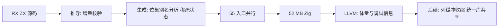

# 架构诊断复核

## Intent：最终目标

逐条核对外部诊断（antigravity）对 zxc 编译性能与设计原则的判断：成立的给出已实施的修复或后续方案，不成立的用实测数据纠正，避免按错误归因继续投入。行数限制按用户 2026-10-11 的要求只保留在 lint 层面。

## Data：可用证据

- 基线与修复数据见 [实施记录](实施记录.md) 与 [分阶段测量报告](../../2026-10-10/编译性能分阶段定位/性能测量报告.md)。
- 本轮新增测量均使用同一份生成产物、同一条 `zig build-exe` 命令和全新缓存目录；机器上同时有其他会话的编译任务。
- 跨入口重复用“函数体去掉编号后取哈希”统计，编号包括 function、block、operand、类型名等由生成器按入口分配的序号。

## Edges：边界与限制

- 结构性重构（统一库自举、分析下沉到 IR、RX 错误传播）只给出方案，不在本轮混入，便于分别验证。
- 去掉调试信息会让 panic 栈追踪失去源码位置，因此只作为显式构建选项，不改默认值。
- 本轮不新增、不运行功能测试。

## Answer：逐条结论

| 诊断条目                                    | 复核结论                                 | 证据与处理                                                                                                                                                                                                                                                  |
| ------------------------------------------- | ---------------------------------------- | ----------------------------------------------------------------------------------------------------------------------------------------------------------------------------------------------------------------------------------------------------------- |
| 推导期 O(N²) 重复全量 IR 校验               | **成立，已修复**                         | 共享表只校验未验证的行，根、新增函数和跨表检查照常执行，emit 前对最终 Program 仍做完整校验。单入口 infer 15.38 → 0.37 秒；seed 与 RX/ZX 校验都已接入。这正是诊断建议的“已验证事实固化 + 增量校验”。                                                         |
| genz 整表快照、36 GiB 复制、外层 arena 保留 | **成立，已修复**                         | 稀疏写入记录的状态表、逐 lane 别名证明批量化为一次 origin 位集不动点、显式 workspace。55 入口主生成 158.9 → 28.1 秒（再加并行 → 7.6 秒），RSS 3.89 → 1.06 GB（串行），94/94 产物逐字节一致。                                                                |
| 别名分析应下沉到前端/IR 层                  | **方向合理，非当前瓶颈**                 | 修复后生成阶段整体只剩数秒；下沉的价值在于职责清晰与跨后端复用，作为后续结构项单独实施。                                                                                                                                                                    |
| 55 个入口各自展开，400+ 相同函数重复数十次  | **成立（本表原判“不成立”有误，已更正）** | 原统计未去掉 `value_zx_type_<N>_<哈希>` 中的序号，把相同函数误判为不同。改用划分细化复核后，生成函数代码 41.5 MB 中唯一部分仅 18.3 MB，重复 56%；analyzer 与 expression_analysis 共享 92%。详见 [架构问题分析报告](../编译器架构分析/架构问题分析报告.md)。 |
| 冗余局部变量与 block 挤爆 LLVM              | **不成立**                               | 把 34,133 个只用一次的纯投影临时量内联后，zxc 编译 62.2 → 61.5 秒，RSS 5.47 → 5.46 GB，无可分辨收益。                                                                                                                                                       |
| LLVM 调试信息负担                           | **部分成立**                             | 关闭调试信息后 zxc 编译约 60 → 38 秒、5 → 3 GB；新增 `zig build -Dstrip=true` 选项。第二轮单模块复测确认逐模块 strip 有效，生成模块已默认不带调试信息（见实施记录第二轮）。                                                                                 |
| 生成代码体量                                | **成立，是后端主因**                     | buffered 变体占生成函数代码 67–70%，主要是循环状态里上百个列字段各自的缓冲容量代码。需要在 genz 的列缓冲生成形态上收缩，属于后续项。                                                                                                                        |
| standard-types 额外整编宿主编译器           | **诊断未覆盖，已修复**                   | 仅为 38 KB 的 ABI 文件整编含全部生成代码的编译器（41 秒、3 GB）；改由 seed 生成器以 `--standard-abi` 模式输出，逐字节一致。                                                                                                                                 |
| 120 行硬限制导致微碎片化                    | **按用户要求调整**                       | 行数改为 `zxc lint` 的可配置检查（默认 120，`--max-lines 0` 关闭），编译入口与编译器自身不做限制；AGENTS.md 同步改为按语义拆分、禁止机械切片和转发层。已有微文件的合并属于后续重构。                                                                        |
| RX 缺少错误传播导致 Switch 金字塔           | **成立，属语言能力缺口**                 | 需要在 RX 增加声明式短路返回（如诊断非空即返回），由编译器展开为普通 Zig 分支，不引入运行时。作为独立语言特性设计实施。                                                                                                                                     |

| 阶段（实际 CLI 构建） |       会话开始 |                                              当前 |
| --------------------- | -------------: | ------------------------------------------------: |
| generate-parser 运行  |      约 153 秒 |                                              7 秒 |
| standard-types 编译   |    41 秒、3 GB |                                    0（4 ms 运行） |
| zxc 后端编译          | 约 60 秒、5 GB | 约 60 秒、5 GB（`-Dstrip=true` 时约 38 秒、3 GB） |
| 整体构建墙钟          |         149 秒 |                                          124.8 秒 |

## 自我批判

本文原判跨入口去重收益约一成，后经[架构问题分析报告](../编译器架构分析/架构问题分析报告.md)复核，归一化遗漏了带结构哈希的类型名，实际重复 56%，统一生成是剩余后端成本的首要来源。消除临时变量一项实测收益为零的结论不变。
