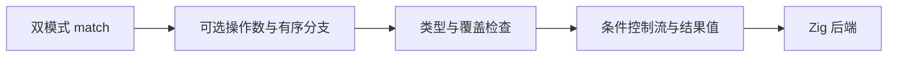
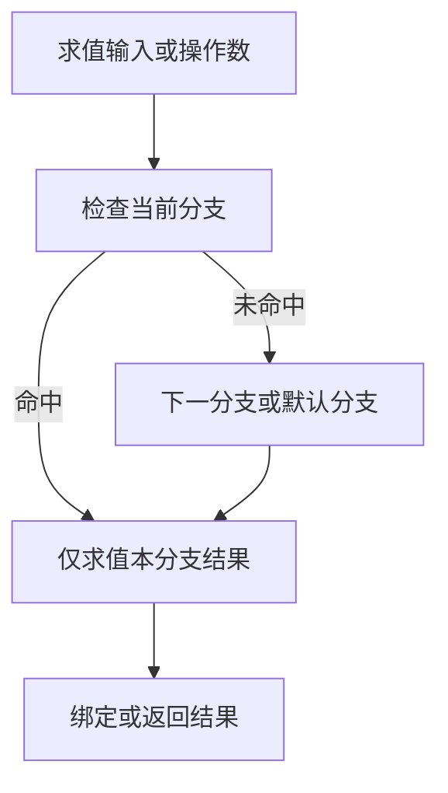

# ZX match 设计

## Intent：最终目标

以可返回值的双模式 `match` 表达局部分支，避免多层三元表达式，使业务条件与结果逐行对应。它属于 ZX 计算层，不承担 RX 编排。

## Data：可用证据

依据作者本次提供的 2026-08-24 设计对话。最终明确选择的是无操作数条件模式与有操作数值模式，以及 `=>` 和 `_`。附件是设计讨论，未包含可直接调用的实现。现已根据后续授权接入词法、解析、类型分析、IR 校验、所有权分析和 Zig 生成。

## Edges：边界与限制

保留 ZX 既有 `const`、显式类型和不可变绑定规则，不照搬讨论中的 `let`。不将 AI 建议的区间、结构解构、隐式变量、链式比较或求解器集成视为已经采纳。逻辑连接符已确认统一使用现有 `&&`，不新增 `and`。

## Answer：语法与语义

### 条件模式

```ts
const shipping = match {
  discounted >= in.free_shipping_minimum => 0,
  _ => in.shipping_fee
};
```

无操作数时，左侧为完整布尔条件，右侧为结果表达式。按源码顺序选择第一个成立的分支，只求值选中分支的结果；`_` 表示默认结果。

### 值模式

```ts
const label = match status {
  "paid" => "ready",
  "pending" => "waiting",
  _ => "blocked"
};
```

有操作数时，先求值目标，再以左侧值进行匹配。目标只求值一次，避免重复调用或读取产生不同结果。示例限定为标量值匹配，不推定支持对象深比较或任意模式解构。

### 当前实现契约

采用以下明确、有限的实现边界：

- 条件分支必须得到 `bool`；值分支与操作数类型兼容。
- 结果按上下文确定统一类型，遵循现有类型兼容规则，不引入 JavaScript 隐式转换。
- 要求一个且仅一个末尾 `_`，保证表达式有结果；即使枚举已经穷举也不能省略。
- 重叠条件保持源码顺序，不允许优化改变首个命中的语义。
- 采用逗号分隔分支，允许末尾逗号和嵌套表达式。
- 值模式允许非 void 标量及枚举，包括浮点数与字符串；匹配项为同类型表达式，按顺序惰性求值。对象、列表及可选值不作为目标。
- 无操作数的首个 `{` 表示条件模式；带括号目标表达式自然允许。

### 降低到现有编译路径





条件模式降低为有序条件表达式。值模式在标签块内保存操作数，再生成等值条件链。跳转表、内联和其他优化是否发生由实际后端和测量决定，不能仅凭 match 语法承诺零开销或最优机器码。

## 自我复核

提取作者明确选择，区分设计、建议与实现。没有复制附件中与本任务无关的模型评价、Z3/Dafny 断言或自动合成最优机器码的承诺。当前实现未承诺模式解构、区间或静态穷举；新增语义的覆盖范围及已执行检查见[实施记录](2026-10-03/匹配表达式与标准类型实施.md)。
