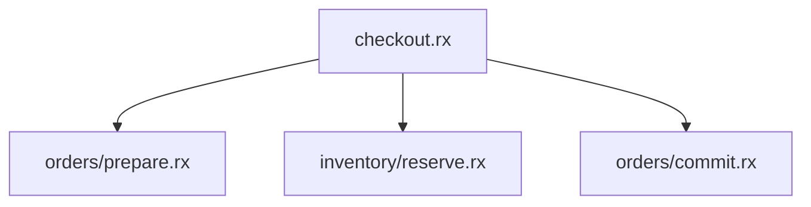
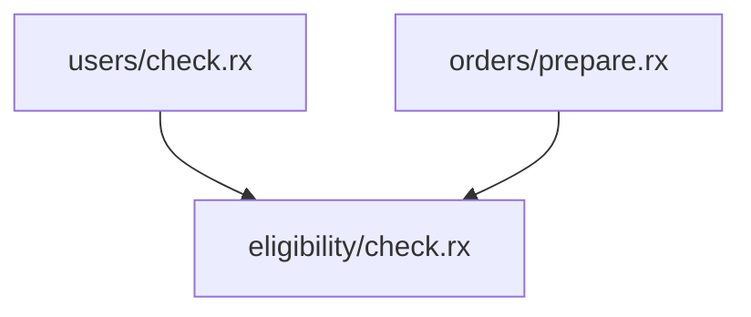

# 消除循环依赖

模块不能相互调用，但业务仍然可以完成多阶段协作。关键是让一个明确的父模块安排顺序，并通过输入输出把各阶段连接起来。

## 先判断为什么形成环

遇到 A → B → A，先记录实际文件路径和形成环的调用位置，然后回答：

1. A 为什么需要 B 的结果，B 又为什么需要 A？
2. B 需要的是 A 的已有数据、A 的某项计算能力，还是 A 的整个流程？
3. 谁负责调用顺序、事务、失败处理与最终输出？
4. 所谓循环是模块相互依赖，还是业务时间线上需要多个处理阶段？

业务顺序 `处理 A → 处理 B → 再处理 A 的结果` 并不要求存在 `A → B → A` 的模块依赖。通常缺少的是一个明确的协调者，或模块职责划分过粗。

## 方案选择

| 真实需求                         | 合适的方案                   | 重构后的关系                         |
| -------------------------------- | ---------------------------- | ------------------------------------ |
| A、B 需要按顺序协调业务          | 提取父模块编排               | Parent → A，Parent → B               |
| A、B 都需要一项相同能力          | 提取独立共享模块             | A → Common，B → Common               |
| B 只是缺少 A 已经持有的数据      | 从调用方传入数据，返回结果   | Parent 传递结果，下层不反向调用      |
| 两者共同维护一个不可分割的不变量 | 收拢到一个职责完整的模块     | 一个模块拥有该流程，内部使用 ZX 能力 |
| 算法确实需要迭代                 | 在受支持的计算层定义有界算法 | RX 模块图仍保持 DAG                  |
| 业务确实允许异步完成             | 单独设计状态推进与事件契约   | 明确终止条件，不能形成隐藏同步环     |

### 方案一：父模块负责顺序和协调

原问题：订单模块调用库存，库存又回调订单提交，形成双向依赖。

将“订单准备”和“订单提交”分开，由 checkout.rx 协调：

```text
checkout.rx
orders/prepare.rx
orders/commit.rx
inventory/reserve.rx
```

checkout.rx：

```xml
<Module in="CheckoutInput" out="CheckoutOutput">
  <Call service="orders/prepare" args={$in} name="prepared" />

  <Call
    service="inventory/reserve"
    args={ctx.prepared.items}
    name="reservation"
  />

  <Call
    service="orders/commit"
    args={{order:ctx.prepared,reservation:ctx.reservation}}
    name="order"
  />
</Module>
```



库存只接收必要输入并返回预留结果，不调用订单模块。订单提交只接收准备结果和预留结果，不重新调用库存。

示例中的模块需要在应用中实现。这个编排关系不会自动提供跨阶段事务或失败补偿；如果预留库存后提交订单失败，必须按照业务要求和目标环境支持的机制处理，不能默认已经自动回滚。

父模块也可以多次调用同一个独立子模块。Parent → A、Parent → B、Parent → A 的执行顺序不会产生 A → B 或 B → A 的依赖边。是否应复用同一个子模块，由其职责和输入输出决定。

### 方案二：提取共享能力

如果用户模块和订单模块互相调用，只是都需要“购买资格计算”，把这项独立计算放入 eligibility/check.rx：



共享模块只依赖更底层能力，所需用户、订单事实通过输入传入。它不能再调用 users/check.rx 或 orders/prepare.rx，否则只是把两节点环扩大成三节点环。

不要把整个业务搬进一个没有明确职责的 common 模块。只有稳定、独立、确实复用的能力才值得提取。

### 方案三：传递数据，取消反向查询

当库存为了获得订单明细而调用订单模块时，先检查调用方是否已经持有明细。已有数据应通过 `in` 传入，处理结果通过 `out` 返回父模块。

输入应是明确的数据或快照，不是“回调调用方”的函数、动态模块名或服务查找句柄。不要把相同的反向调用藏进输入对象。

通过已存在的数据切断依赖前，还要确认快照时效性和并发版本语义；不能为了无环而偷偷改变一致性要求。

### 方案四：收拢不能合理分离的职责

如果 A、B 总是一起维护同一个不变量、必须共同完成才能有意义，而且无法给出独立输入输出，当前拆分可能本身有问题。

将这一个业务过程收拢到单一 RX 模块，以多个职责清晰的 ZX 调用表达内部计算。只有一项共同职责时才合并；不要把无关领域都放进一个大模块，也不要把模块循环偷偷转移成 ZX 函数之间的不受控递归。

### 方案五：真正的迭代不使用模块互调模拟

收敛计算、树遍历和分页处理可能需要迭代，这和 RX 模块依赖成环是两个问题。

若计算层已经支持所需算法，应在那里实现，并明确有限输入、最大步数或严格递减的度量，以及超出边界的结果。不能仅声称“通常会结束”。

不要自行添加 Loop 标签。如果所用版本无法表达需要的算法，说明这部分需求暂不能完成，或与使用方确认可行替代方案；不要通过模块互调或根据示例数据写死展开次数来冒充算法。

### 方案六：异步业务需要显式的推进与终止

只有业务不要求在当前调用栈立即获得结果时，才考虑异步事件。事件契约至少需要明确事实、处理方、关联标识、幂等规则、允许的状态迁移及终止状态。

例如，“订单已创建 → 发起通知 → 通知完成”可以是单向事实传播；“A 收到 B 事件后再发 A 事件，B 又重新触发 A”仍可能无限运行。

处理重复投递不能再次触发已经完成的同一迁移。重试和运行预算是执行保护，不是证明没有反馈循环的替代品。

**能写出 Emit 声明，不代表目标环境已经具备完整的事件处理能力。** 使用前确认所用版本和应用环境是否提供订阅、调度与状态推进机制。缺少这些能力时，将异步方案标为尚不可运行，不要发明 On、Subscribe 等标签。

## 不要这样修复

- 不把反向调用移到另一个分支或包装模块中；调用关系没有改变，环就仍然存在。
- 不换路径拼写、复制一份同逻辑模块、使用符号链接或仅改名来隐藏环。
- 不把“回调父模块”的要求藏进输入数据、全局对象或服务查找操作。
- 不发明允许递归的属性或标签，不通过放宽次数限制把非法依赖变成合法。
- 不把 A 的同步调用换成“发事件并等待 B，再由 B 回调 A”，然后宣称没有循环。

## 重构后的检查

沿着实际业务文件重新检查调用关系，包含被调用模块继续调用的其他文件。确认原来的反向调用已删除，父模块和共享模块没有形成新的环，再按[应用验证与交付](验证与交付.md)检查业务行为。

- [ ] 原来形成环的反向调用已经删除。
- [ ] 子模块没有回调父模块，共享模块没有依赖使用方。
- [ ] 输入输出、状态一致性和失败处理没有被悄悄改变。
- [ ] 已检查所有相关模块的调用关系，而不只是本次修改的两个文件。
- [ ] 尚不可运行的方案与已验证的应用代码有明确区分。
